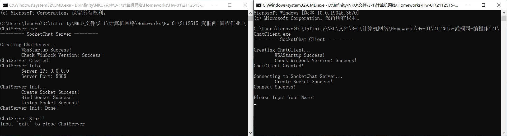
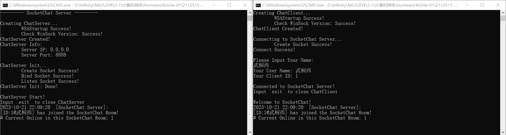
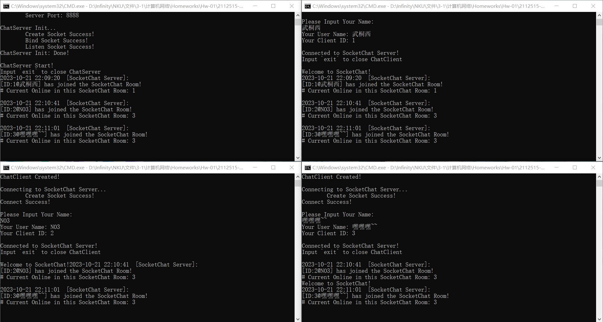
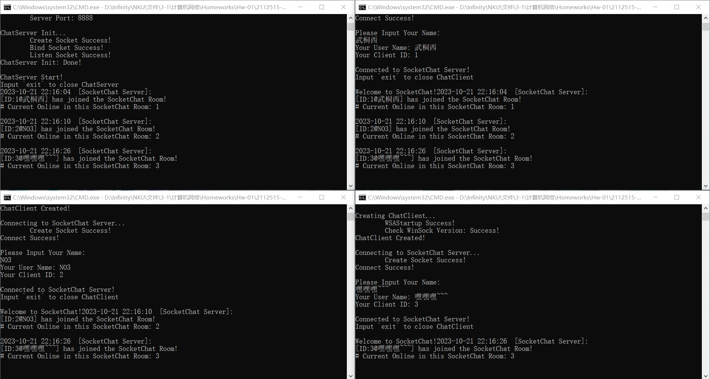
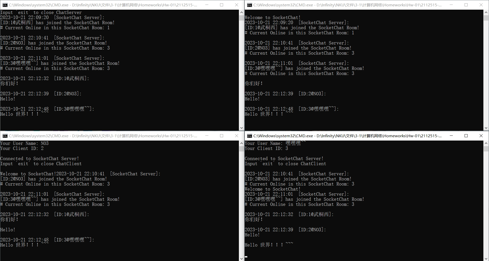
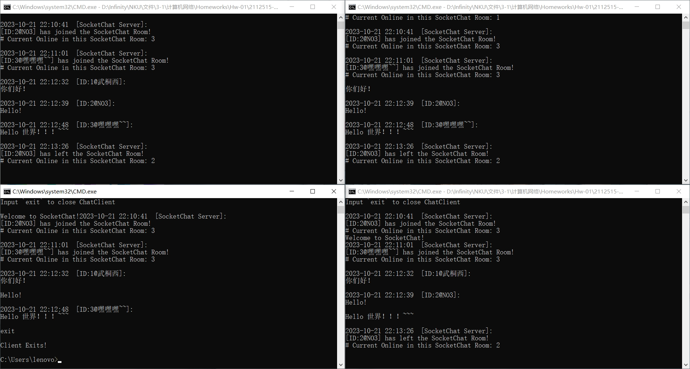
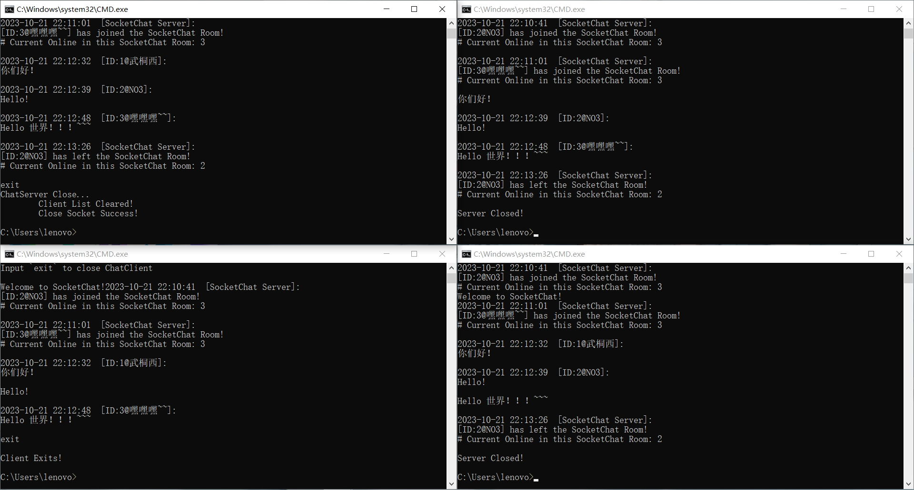

# 实验1：利用 Socket 编写一个聊天程序

> 武桐西 2112515

## 总览

本次实验实现了一个基于 `Socket` 的聊天程序 `SocketChat`，包括服务器端 `ChatServer` 和客户端 `ChatClient` ，能够实现多人聊天，包括 **本地聊天** （ **本地连接** ）与 **多主机聊天** （ **公网连接** ）。

## 一、聊天协议设计

在本 `SocketChat` 聊天室程序的聊天协议的设计中，主要包括以下四种协议：

1. 客户端 `Client` 连接服务器 `Server` 的连接验证协议

2. 客户端 `Client` 与服务器 `Server` 之间的消息传输协议

3. 客户端 `Client` 与服务器 `Server` 之间的断开连接协议

4. 服务器关闭协议

### 1. 客户端 `Client` 连接服务器 `Server` 的连接验证协议

#### 1.1 连接验证协议内容

客户端 `Client` 连接服务器 `Server` 的连接验证协议主要包括：客户端 `Socket` 在服务器端 `Server` 的存储、服务器端 `Server` 为客户端 `Client` 自动分配 `ID` 作为客户端 `Client` 的唯一标识、客户端 `Client` 与服务器 `Server` 之间的用户名验证、客户端 `Client` 与服务器 `Server` 之间的欢迎消息发送、客户端 `Client` 与服务器 `Server` 之间的在线客户端广播消息发送等。

在服务器端 `Server` 中，需要存储客户端 `Client` 的 `Socket` 以及客户端 `Client` 的唯一标识 `ID` 、用户名 `userName` 等信息。

#### 1.2 连接验证协议流程

当客户端 `Client` 向服务器 `Server` 发起连接请求时，服务器 `Server` 会记录请求连接的客户端 `Client` 的 `Socket` ，并自动为客户端 `Client` 生成一个客户端 `ID` （默认为递增），随后将该 `ID` 发送给客户端 `Client` ，客户端 `Client` 会记录下自己的 `ID` 。

为客户端 `Client` 分配 `ID` 的目的在于唯一标识客户端，避免出现用户名相同的客户端发送的消息无法区分的问题。

为防止前面的客户端输入用户名时发生阻塞，导致后面的客户端无法连接服务器，因此这里会首先由服务器 `Server` 为客户端分配一个默认的用户名（ `User` + 客户端 `ID` ），随后服务器端 `Server` 会为该客户端 `Client` 开启一个 `RecvMsgThread` 线程，该线程与客户端 `Client` 的 `Socket` 绑定，用于后续的连接验证过程以及接收客户端 `Client` 发送的消息。

在 `RecvMsgThread` 线程中，服务器 `Server` 会要求客户端 `Client` 输入自己在当前 `SocketChat` 聊天室中的用户名 `userName`，当服务器接收到客户端 `Client` 发送的用户名 `userName` 信息后，服务器端会将该客户端的默认用户名更新为客户端 `Client` 发送的用户名 `userName` 。

之后，服务器 `Server` 会向客户端 `Client` 发送欢迎消息，同时会向所有已连接的客户端 `Client` 广播当前客户端连接进入聊天室的消息以及当前的在线客户端数目。

至此，客户端 `Client` 与服务器 `Server` 的连接验证协议完成。

### 2. 客户端 `Client` 与服务器 `Server` 之间的消息传输协议

#### 2.1 服务器端 `Server` 接受客户端消息并广播

在服务器 `Server` 为客户端 `Client` 开启的 `RecvMsgThread` 线程中，服务器 `Server` 会等待与其绑定的客户端 `Client` 发送消息，客户端无消息发送时，会进入 **阻塞状态** ，直至客户端 `Client` 发送消息或断开连接。

当该线程接收到来自客户端 `Client` 的消息时，服务器 `Server` 会将该消息打上此时的 **时间戳** ，并添加当前客户端的 **标识信息** （客户端 `ID` 和用户名 `userName` 等），随后向 **除了当前的客户端 `Client`** 之外的所有的 **其他** 客户端广播该修改后的消息。

同时，服务器端 `Server` 会在本地服务器端将相关的消息记录到日志中，以便于后续的查看以及服务器的维护。

**注意：**

- 服务器为消息打上的时间戳为 **服务器接收到消息后、广播消息前** 时 **服务器** `Server` 的系统时间，而不是客户端发送消息的时间。

- 这样做的原因一方面是，如果使用客户端发送消息的时间作为时间戳，那么当客户端的系统时间与服务器的系统时间不一致时，就会导致消息的时间戳不一致，这样会给用户造成困扰；另一方面，统一以服务器接收到消息后、准备广播消息前的时间为基准，可以更好地应对高并发的情况，避免各个客户端上收到的同一客户端发送的消息的显示时间（时间戳）互不相同。

#### 2.2 客户端 `Client` 接收服务器消息并向服务器发送消息

在客户端 `Client` 与服务器端 `Server` 连接完成后，会开启一个 `RecvMsgThread` 线程，用于接收服务器 `Server` 发送的消息，当客户端 `Client` 接收到服务器 `Server` 发送的消息时，会在本地客户端打印该消息，以及该消息的时间戳和发送者的标识信息，以便于用户查看。

在该线程创建之后，客户端可以随时向服务器端发送消息。

### 3. 客户端 `Client` 与服务器 `Server` 之间的断开连接协议

当客户端 `Client` 输入断开连接命令 `exit` 时，客户端 `Client` 通过 `shutdown` 函数关闭客户端 `Socket` 的 `send` 和 `recv` 服务，随后客户端 `Client` 会主动关闭客户端 `Socket` ，并退出程序。

服务器 `Server` 监听到客户端 `Client` 正常退出（通过 `RecvMsgThread` 线程的 `recv` 函数的返回值是否为 `0` 判断）后，会将该客户端 `Client` 从在线客户端列表中移除，并向所有在线的客户端广播该客户端 `Client` 的断开连接消息，随后关闭该客户端 `Client` 的 `Socket` ，并关闭与该客户端 `Client` 绑定的 `RecvMsgThread` 线程。

### 4. 服务器关闭协议

#### 4.1 服务器端 `Server`

在服务器 `Server` 启动时，会创建一个 `ServerExit` 线程，该线程用于监控服务器端是否输入退出命令 `exit` 。

当 `ServerExit` 线程监听到服务器 `Server` 端主动输入退出命令 `exit` 时，服务器 `Server` 会遍历存储的客户端列表，逐个关闭与对应客户端的 `send` 和 `recv` 服务，并关闭客户端 `Socket`，同时关闭所有在线客户端的 `RecvMsgThread` 线程。

然后，清空客户端列表，随后关闭服务器 `Server` 的 `Socket` ，退出程序。

#### 4.2 客户端 `Client`

由于服务器 `Server` 正常退出，客户端 `Client` 接收到服务器正常退出的消息后，会在本地客户端打印 `Server Closed!` 的消息，随后主动关闭客户端 `Client` 的 `Socket` ，退出程序。

## 二、核心模块功能

本 `SocketChat` 聊天程序主要封装了两个核心模块：`ChatServer` 类和 `ChatClient` 类。

### `ChatServer`

在 `ChatServer` 中，使用了双向链表 `list` 这种数据结构来存储所有在线的客户端 `Client` 的信息，包括：

- `list<SOCKET> clientSocketList` 记录客户端 `Client` 的 `Socket`

- `list<string> userNameList` 记录客户端 `Client` 的用户名 `userName`

- `list<unsigned int> clientIDList` 记录客户端 `Client` 的唯一标识 `ID`

服务器端 `ChatServer` 的 `IP` 地址可以通过 `INADDR_ANY` 设置为 `0.0.0.0` ，即任意 `IP` 地址，以便于实现 **多主机** 聊天（公网连接）。

若将服务器端的 `IP` 设置为本地地址 `127.0.0.1` （`localhost`），则无法实现 **多主机** 聊天功能。

### `ChatClient`

客户端 `ChatClient` 不使用 `bind` 函数显式地绑定硬编码的 `IP` 地址和端口号，而是自动获取客户端主机的 `IP` 地址并由系统分配端口号，因而具有更高的拓展性和通用性。

同时，客户端需要明确知道服务器的 `IP` 地址和端口号，以便连接服务器并实现通信。

### 1. 服务器接收客户端消息

由于 `SocketChat` 需要支持多人聊天（多个客户端），因此服务器接收客户端消息应采用多线程来实现，封装在 `RecvMsgThread` 这一线程函数中。

```C++
DWORD WINAPI ChatServer::RecvMsgThread(LPVOID lpParameter) {
	SOCKET clientSocket = (SOCKET)lpParameter;
	char recvBuf[DEFAULT_BUFLEN + 1];
	int recvLen;

	// 接收客户端用户名
	recvLen = recv(clientSocket, recvBuf, DEFAULT_BUFLEN, 0);
	char* userName = new char[recvLen + 1];
	strncpy_s(userName, recvLen + 1, recvBuf, recvLen);
	userName[recvLen] = '\0';

	// 更新客户端用户名
	unsigned int clientID;
	list<SOCKET>::iterator it_clientSocket = clientSocketList.begin();
	list<string>::iterator it_userName = userNameList.begin();
	list<unsigned int>::iterator it_clientID = clientIDList.begin();
	for (int i = 0; i < clientIDList.size(); i++) {
		if (*it_clientSocket == clientSocket) {
			*it_userName = userName;
			clientID = *it_clientID;
			break;
		}
		it_clientSocket++;
		it_userName++;
		it_clientID++;
	}

	// 发送欢迎消息
	send(clientSocket, WELCOME_MSG, strlen(WELCOME_MSG), 0);

	// 广播消息
	string msg = "[ID:" + to_string(clientID) + "@" + userName + "] has joined the SocketChat Room!\n";
	msg += "# Current Online in this SocketChat Room: " + to_string(clientIDList.size());
	SendMsgToAll((char*)msg.c_str(), msg.length());

	while (true) {
		// 接收客户端消息
		recvLen = recv(clientSocket, recvBuf, DEFAULT_BUFLEN, 0);
		if (isExit) // 服务器退出
			break;
		if (recvLen == SOCKET_ERROR) {
			cout << "--------- RecvMsgError ---------\n";
			cout << "Recv Socket Fail!\n";
			cout << "Error Code: " << WSAGetLastError() << endl;
			cout << "Client Socket: " << clientSocket << endl;
			cout << "Client ID: " << clientIDList.back() << endl;
			cout << "User Name: " << userNameList.back() << endl;
			cout << "The Client has exited unexpectedly!\n";
			cout << "--------------------------------\n";
		}
		else if (recvLen == 0) {
			// 客户端关闭
		}
		else {
			recvBuf[recvLen] = '\0';
			// 广播消息
			SendMsgToAll(recvBuf, recvLen, clientSocket);
			continue;
		}

		// 退出信息记录
		unsigned int quitClientID;
		string quitUserName;

		// 清除客户端信息
		list<SOCKET>::iterator it_clientSocket = clientSocketList.begin();
		list<string>::iterator it_userName = userNameList.begin();
		list<unsigned int>::iterator it_clientID = clientIDList.begin();
		for (int i = 0; i < clientIDList.size(); i++) {
			if (*it_clientSocket == clientSocket) {
				quitClientID = *it_clientID;
				quitUserName = *it_userName;
				clientSocketList.erase(it_clientSocket);
				userNameList.erase(it_userName);
				clientIDList.erase(it_clientID);
				break;
			}
			it_clientSocket++;
			it_userName++;
			it_clientID++;
		}

		// 退出信息
		msg = "[ID:" + to_string(quitClientID) + "@" + quitUserName + "] has left the SocketChat Room!\n";
		msg += "# Current Online in this SocketChat Room: " + to_string(clientIDList.size());

		// 广播消息
		SendMsgToAll((char*)msg.c_str(), msg.length(), clientSocket);
		closesocket(clientSocket); // 关闭客户端 Socket
		break;
	}
    return 0;
}
```

服务器接受客户端的连接请求后，会为每一个客户端分别创建一个 `RecvMsgThread` 线程，用以接受对应客户端发送的消息。函数 `RecvMsgThread` 的参数即为对应客户端 `Client` 的`Socket`。

在 `RecvMsgThread` 中，需要使用 `recv` 函数接收客户端发送的用户名 `userName` 信息，而 `recv` 函数在未收到客户端消息时，会进入 **阻塞状态** 。因此，将接收客户端用户名信息这一个功能放在一个单独的线程中实现，能够 *解决多个客户端连接时前面的客户端由于未输入或未发送用户名信息而导致后面的客户端处于阻塞状态而无法连接服务器的问题* ，这在一定程度上解决了部分 **并发控制** （ *Concurrency Control* ）问题。
在收到客户端发送的用户名信息后，服务器便会更新客户端用户名。

在通过 `send` 发送欢迎消息并通过 `SendMsgToAll` （用于广播消息，后面会详细展开）向所有客户端广播客户端加入聊天室及在线客户端数量等信息后，该线程会进入一个永真循环，通过 `recv` 接收客户端发送的消息，并调用 `SendMsgToAll` 函数向除当前客户端之外的所有在线客户端广播收到的消息。

剩下的部分用于客户端退出。当客户端使用 `exit` 退出时，便会执行这部分代码，清除对应的客户端信息，并广播客户端退出信息，最后进程自动结束，完成整个生命周期。

### 2. 服务器广播消息

服务器广播消息封装在 `void ChatServer::SendMsgToAll(char* msg, int len, SOCKET senderClientSocket)` 函数中，用于服务器向除当前客户端（`senderClientSocket`）之外的所有在线客户端广播收到的消息。

其中，参数 `msg` 代表要广播的消息， `len` 代表消息的长度， `senderClientSocket` 代表需要排除的客户端，默认值为 `INVALID_SOCKET` ，表示没有需要排除的客户端，即服务器向所有在线客户但广播。

```C++
void ChatServer::SendMsgToAll(char* msg, int len, SOCKET senderClientSocket) {
	// 获取当前系统时间
	time_t now = time(nullptr);
	tm localTime;
	localtime_s(&localTime, &now);
	// 格式化输出时间，并转为 string
	string timeStr;
	stringstream timeSStr;
	timeSStr << put_time(&localTime, "%Y-%m-%d %H:%M:%S");
	timeStr = timeSStr.str();

	unsigned int senderIdx; // 发送者序号
	string senderName; // 发送者用户名
	list<SOCKET>::iterator it_clientSocket = clientSocketList.begin();
	list<string>::iterator it_userName = userNameList.begin();
	list<unsigned int>::iterator it_clientID = clientIDList.begin();
	// 寻找发送者
	bool found = false;
	for (int i = 0; i < clientIDList.size(); i++) {
		if (*it_clientSocket == senderClientSocket) {
			senderIdx = *it_clientID;
			senderName = *it_userName;
			found = true;
			break;
		}
		it_clientSocket++;
		it_userName++;
		it_clientID++;
	}

	string sendMsg = timeStr + "  ";
	if (found) {
		sendMsg += "[ID:" + to_string(senderIdx) + "@" + senderName + "]:\n" + msg + "\n";
	}
	else {
		sendMsg += "[SocketChat Server]:\n" + string(msg) + "\n";
	}

	// Log
	cout << sendMsg << endl;

	// 发送消息给所有客户端
	for (it_clientSocket = clientSocketList.begin(); it_clientSocket != clientSocketList.end(); it_clientSocket++) {
		if (*it_clientSocket != senderClientSocket) {
			send(*it_clientSocket, (char*)sendMsg.c_str(), sendMsg.length(), 0);
		}
	}
}
```

在该广播函数中，首先会对要发送的消息进行封装，添加时间以及发送者的信息（服务器或某个客户端），随后会在服务器端输出对应日志，并通过服务器端存储的客户端列表向客户端发送消息。

### 3. 服务器关闭

在服务器启动时，会创建一个 `ServerExit` 线程，用于监听服务器端是否输入退出指令 `exit` ，以便实现服务器的关闭功能。

```C++
DWORD WINAPI ChatServer::ServerExit(LPVOID lpParameter) {
	ChatServer* server = (ChatServer*)lpParameter;
	string exit_str;
	while (true) {
		cin >> exit_str;
		if (exit_str == "exit") {
			isExit = true; // 服务器退出
			server->Close();
			WSACleanup();
			exit(0);
			//break;
		}
	}
	return 0;
}
```

```C++
CreateThread(NULL, 0, ServerExit, (LPVOID)this, 0, NULL); // 创建线程监听服务器退出
```

若服务器端输入退出指令 `exit` ，则 `ServerExit` 线程会将类的静态成员变量 `isExit` 设置为 `true` ，以用于关闭接收客户端消息的线程、停止接收客户端连接等功能，最后会调用 `Close` 函数来关闭服务器。

`Close` 函数用于实现服务器的正常退出。该函数会遍历服务器端存储的在线客户端列表，通过 `shutdown` 关闭客户端的 `send` 和 `recv` 服务，并关闭客户端的 `Socket` ，并清空在线客户端列表，最后关闭服务器的 `Socket` ，实现服务器的正常关闭。

客户端在监听到服务器关闭后（通过 `recv` 函数的返回值是否为 `0` ），会关闭自身的 `Socket` ，实现客户端的正常退出。

```C++
void ChatServer::Close() {
	cout << "ChatServer Close..." << endl;

	// 清空客户端
	list<SOCKET>::iterator it_clientSocket = clientSocketList.begin();
	list<string>::iterator it_userName = userNameList.begin();
	list<unsigned int>::iterator it_clientID = clientIDList.begin();
	for (int i = 0; i < clientIDList.size(); i++) {
		// shutdown
		shutdown(*it_clientSocket, SD_BOTH);
		// closesocket
		closesocket(*it_clientSocket);

		it_clientSocket++;
		it_userName++;
		it_clientID++;
	}

	clientSocketList.clear();
	userNameList.clear();
	clientIDList.clear();

	cout << "\tClient List Cleared!" << endl;

	// 关闭服务器 Socket
	int err = closesocket(serverSocket);
	if (err == SOCKET_ERROR) {
		cout << "\tClose Socket Fail!\n";
		cout << "\tError Code: " << WSAGetLastError() << endl;
		WSACleanup();
		exit(1);
	}
	else
		cout << "\tClose Socket Success!\n";

	cout << "ChatServer Closed!" << endl;
	cout << endl;
}
```

### 4. 客户端接收服务器消息

客户端接收服务器消息是通过 `ChatClient` 类中定义的 `RecvMsgThread` 线程函数实现的。该线程函数的参数为客户端的 `Socket` 。

```C++
DWORD WINAPI ChatClient::RecvMsgThread(LPVOID lpParam) {
	SOCKET clientSocket = (SOCKET)lpParam;
	char recvBuf[DEFAULT_BUFLEN + 1]; // 接收缓冲区
	int recvLen;
	while (true) {
		// 接收消息
		recvLen = recv(clientSocket, recvBuf, DEFAULT_BUFLEN, 0);
		if (isExit) // 退出
			break;
		if (recvLen == SOCKET_ERROR) {
			cout << "--------- RecvMsgError ---------\n";
			cout << "Recv Socket Fail!\n";
			cout << "Error Code: " << WSAGetLastError() << endl;
			cout << "--------------------------------\n";
			cout << "服务器端异常关闭！" << endl;
			// 退出
			closesocket(clientSocket);
			WSACleanup();
			exit(1);
		}
		else if (recvLen == 0) {
			// 服务器关闭
			cout << "Server Closed!\n";
			closesocket(clientSocket);
			WSACleanup();
			exit(1);
		}
		else {
			recvBuf[recvLen] = '\0';
			// 显示消息
			cout << recvBuf << endl;
		}
	}
	return 0;
}
```

`RecvMsgThread` 函数会进入一个永真循环，在循环内通过 `recv` 接收来自服务器的消息，并将消息输出到客户端中，以供用户查看。

`ChatClient` 类的静态成员变量 `isExit` 用于客户端退出时进行一些相关操作。

```C++
// 创建接收消息线程
HANDLE hThread = CreateThread(NULL, 0, RecvMsgThread, (LPVOID)clientSocket, 0, NULL);
```

### 5. 客户端向服务器发送消息

在创建了接收服务器消息的 `RecvMsgThread` 线程后，客户端程序会进入一个死循环，不断读取用户的输入，并将消息发送给服务器，除非用户输入退出指令 `exit`时会跳出循环执行 `Close` 函数关闭客户端。

```C++
// 创建接收消息线程
HANDLE hThread = CreateThread(NULL, 0, RecvMsgThread, (LPVOID)clientSocket, 0, NULL);
if (hThread == NULL) {
	cout << "Create RecvMsgThread Failed!\n";
	closesocket(clientSocket);
	WSACleanup();
	exit(1);
}
CloseHandle(hThread);

// 发送消息
while (true) {
	string msg;
	getline(cin, msg);
	cout << endl;
	if (msg == "exit") {
		// 退出
		isExit = true;
		break;
	}
	else {
		// 发送消息
		send(clientSocket, msg.c_str(), msg.length(), 0);
	}
}
Close();
```

### 6. 客户端退出

当用户输入 `exit` 退出时，上面所示的代码会调用 `Close` 函数，关闭客户端的 `send` 和 `recv` 服务，并关闭客户端的 `Socket` ，同时关闭接收服务器消息的线程 `RecvMsgThread` ，完成客户端的退出。

服务器端在监听到客户端退出后（通过 `recv` 函数的返回值是否为 `0` ），会关闭为其创建的接收消息线程 `RecvMsgThread` ，清除相关客户端信息，并向其他在线客户端广播退出信息和剩余在线人数等信息。

```C++
void ChatClient::Close() {
	// shutdown 关闭发送和接受服务
	shutdown(clientSocket, SD_BOTH);
	// 关闭客户端 socket
	closesocket(clientSocket);
	cout << "Client Exits!\n";
}
```

### 7. 其他

- 本项目已开源，源代码可在[GitHub](https://github.com/InfinityUniverse0/Computer-Networks-2023)中获取。

- 本程序中也实现了对客户端和服务器端异常退出（非正常退出）的相关异常处理，详细请参考源代码，这里不再赘述。

- 服务器和客户端的初始化，以及客户端与服务器的连接等过程均不再赘述。

- 本 `SocketChat` 聊天程序既可以实现本地多客户端聊天（本地连接），也可以实现 **多主机** 聊天（公网连接）。程序默认执行本地服务器连接，若想实现 **多主机** 聊天（公网连接），可以在 `ChatClient` 的构造函数中，传入远程服务器的 `IP` 地址和端口号即可。

## 三、程序运行效果

### 服务器端与客户端上线



### 客户端连接服务器



### 多个客户端连接服务器



第三个客户端（该图片的右下角）连接服务器后，输出的两条客户端 `2` 和 `3` 加入聊天室的消息之间 **没有换行** ，原因如下：

我的操作顺序是，先打开了客户端 `1`，并输入用户名，随后依次打开客户端 `2` 和 `3` ，然后输入客户端 `2` 的用户名，最后输入客户端 `3` 的用户名。这样就会导致客户端 `2` 和 `3` 的加入聊天室的消息之间没有换行。在客户端 `4` 打印成功连接到服务器前，客户端 `2` 和 客户端 `3` 连接到服务器的广播消息已经发送到客户端 `4` ，此时，客户端 `4` 的 `recv` 函数就会 **一次性全部接收** ， *因此不会产生换行* 。

如果依次打开客户端后便立刻输入用户名，再打开下一个客户端，便不会出现不换行的情况。如下图所示：



### 中英文聊天



### 客户端退出



### 服务器端退出



## 四、思考与体会

### 1. 实验过程中遇到的问题

1. 实验过程中，发现服务器端接受客户端连接请求的 `accept` 并未阻塞，导致服务器异常，经过排查和查阅资料，发现 `accept` 函数的第三个参数必须初始化，否则会导致 **不阻塞** 问题。

2. 使用 `CreateThread` 函数创建线程时，线程函数必须是全局函数或类内的静态成员函数，否则编译会不通过。

3. 若将客户端连接服务器时，接收客户端输入的用户名的代码块放在接收服务器消息的线程函数 `RecvMsgThread` 外，会导致 *多个客户端连接时前面的客户端由于未输入或未发送用户名信息而导致后面的客户端处于阻塞状态而无法连接服务器* 的问题。这里采取的解决措施是服务器端先为客户端分配一个默认用户名，然后开启 `RecvMsgThread` 线程，等待用户输入用户名。这实际上也是一种简单的 **并发控制** （ *Concurrency Control* ）。

### 2. 感悟

1. 初次使用 **多线程编程** ，我发现需要考虑很多的 **时序问题** 、 **并发问题** ，这无疑增加了多线程编程的难度，需要审慎思考，慎重处理。

2. 对基于 `Socket` 的网络通信有了更深刻的理解，同时也更加深刻地认识到 **协议** 以及 **规范** 对于工程应用的重要性和必要性。

### 3. 未来展望

1. 可以实现 **互斥锁** ，以保证更好的并发控制。

2. 可以实现分组聊天，即将客户端分为不同的组，每个组内的客户端可以相互聊天，不同组的客户端无法相互聊天。

3. 可以实现图形化界面，使得程序更加美观。

<!-- ---

**实验要求：**

（1）给出你聊天协议的完整说明。

（2）利用C或C++语言，使用基本的Socket函数完成程序。不允许使用CSocket等封装后的类编写程序。

（3）使用流式套接字、采用多线程（或多进程）方式完成程序。

（4）程序应有基本的对话界面，但可以不是图形界面。程序应有正常的退出方式。

（5）完成的程序应能支持多人聊天，支持英文和中文聊天。

（6）编写的程序应该结构清晰，具有较好的可读性。

（7）在实验中观察是否有数据的丢失，提交可执行文件、源码和实验报告。

**评分标准：** 前期准备（10分）、协议设计（15分）、实验过程（35分）、程序及规范性（20分）、实验报告（20分），总分（100分）

--- -->
