# 实验2：配置Web服务器，编写简单页面，分析交互过程

> 武桐西 2112515

## 一、Web服务器搭建

使用 Apache 搭建Web服务器，默认使用的端口号为 80。

使用 **HTTP** 协议和 **TCP** 协议，其中 **HTTP** 为 **1.1**，相比于 HTTP 1.0，**HTTP 1.1** 可以进行**持久化连接**，能够减少 TCP 的慢启动过程，同时还可以实现 **流水线机制** ，提高了效率。

开启 Apache 服务后，即可使用浏览器通过Web访问本地编写的HTML页面。比如在浏览器地址栏输入本机IP地址（可通过 `ipconfig` 命令查询）或本机回环地址 `127.0.0.1` ，以及端口号（默认为 80），就可以访问本机的Web页面。

> 为了方便，这里选用 `Xampp` 集成的 Apache 。

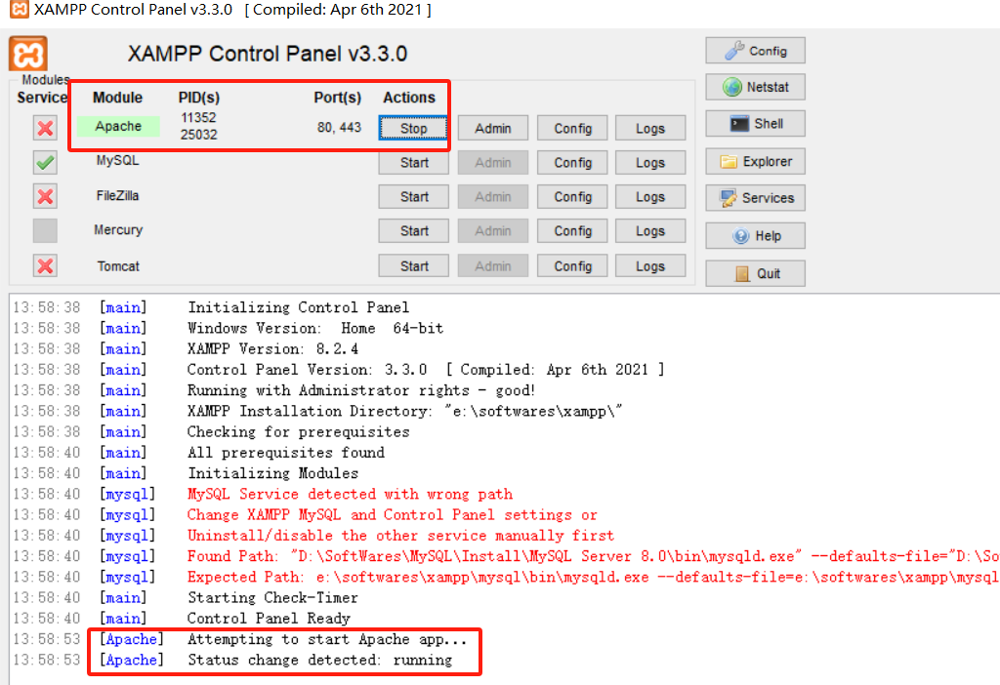

编写的Web文件的文件夹放在 `Xampp/htdocs` 路径下，文件夹的名称即为后面要访问的 URL 的部分路径。在本次实验中，文件夹名为TongxiWu-Homepage，因此可以通过访问 `http://127.0.0.1/TongxiWu-Homepage/` （默认端口为 80，默认会访问 `Xampp/htdocs/TongxiWu-Homepage/` 路径下的 ``）URL来访问Web网页。

## 二、制作Web网页

### Web网页文件结构

```bash
TongxiWu-Homepage:
├─assets
│  ├─audio
│  ├─css
│  └─images
└─index.html
```

### index.html

编写名为 `index.html` 的文件，作为Web网页的主要文件。**命名为 index，是因为访问url时默认会进入index.html或index.php**。

整个HTML文件主要由两部分组成：`head` 和 `body`。

- `head` 部分中，主要包括字符集、页面标题、导入的 `CSS` 文件或 `JavaScript` 文件等依赖、以及一些其他的元信息（Meta）等。这些信息一般不会在Web页面中直接显示。
- `body` 部分即为Web页面的主要内容。

本次编写的 `index.html` 文件的 `body` 部分主要有 `logo` 图片资源（`.jpg`格式）、相关的个人信息（基本上是 **纯文本** 形式）、一段音频资源文件（`.mp3` 格式），最后是一些超链接。

在超链接部分，需要使用 `FontAwesome` 提供的图标，可以使用 `i` 元素标签引入。需要注意的是，这需要在 `head` 部分引入如下外部依赖：

```html
<link rel="stylesheet" href="https://cdnjs.cloudflare.com/ajax/libs/font-awesome/6.2.0/css/all.min.css">
```

### 静态文件

在 `assets` 文件夹中，包含三个子文件夹：

- `audio` ：存放音频资源文件。
- `css` ：`index.html` 的样式表，用于指定HTML文件中元素的样式。里面指定了文本对齐方式、字号、字体、字间距、背景图片的路径和样式等与元素样式相关的内容。
- `images` ：存放图片资源（包括logo图片和HTML背景图片）。

### 网页效果

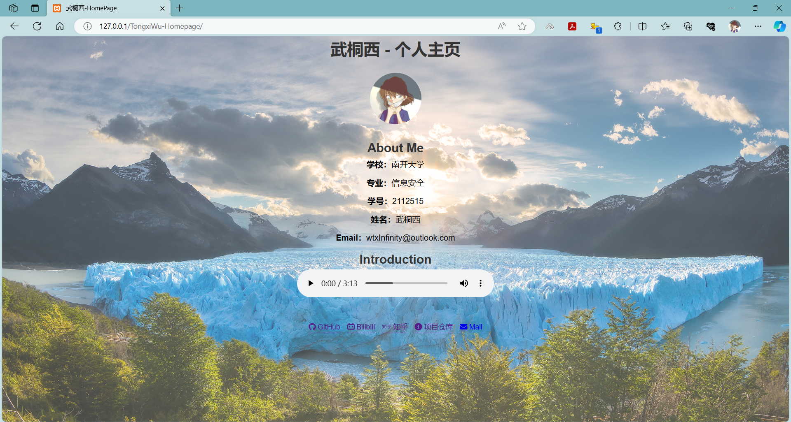

## 三、WireShark 抓包分析

开启 Apache 服务，打开 WireShark，访问Web网页，进行抓包分析。

### 接口选择

由于是在**同一台主机**上进行分析，因此需要选择捕获**本机回环地址**中的数据包，选择 `Adapter for loopback traffic capture`：

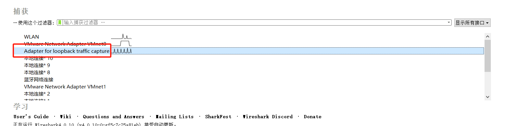

### 过滤器规则

由于要捕获的数据包主要是 **http** 协议和 **tcp** 协议，而我们 Web 网页使用的端口号为 **80**，因此应用一下过滤器规则：

```python
(http or tcp) and tcp.port == 80
```

### 三次握手，建立连接

应用上述过滤器规则后，访问 `http://127.0.0.1/TongxiWu-Homepage/` （实际上完整的URL是 `http://127.0.0.1:80/TongxiWu-Homepage/index.html`），查看 WireShark。

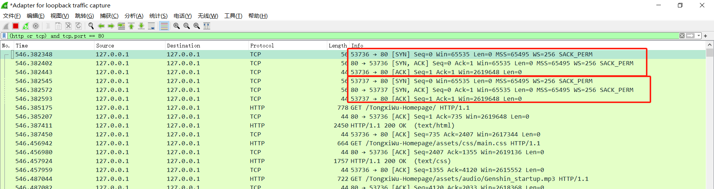

可以看到，客户端（端口 `53736` 和端口 `53737`）分别与服务器（端口 `80`）通过三次握手建立连接。

具体而言，建立连接前，服务器处于 `listen` 状态，客户端处于 `close` 状态。

1. 建立连接时，客户端向服务器端发送 `SYN` ，初始序列号ISN为**随机生成**的（设为 $m$），而WireShark中使用的实际上是**相对的**序列号，因此是从 0 开始。
2. 服务器端向客户端回复 `SYN + ACK` ，初始序列号同样也是**随机生成**的，与前面客户端的ISN无关，设为 $n$ ，而 `ACK` 为 $m + 1$ 。
3. 客户端向服务器端发送 `ACK` ，序列号为 `m + 1` ，`ACK` 为 $n + 1$ 。**注意**：此时客户端可以**同时**发送数据请求服务器，比如发送对HTML的请求。

至此，客户端与服务器端的连接建立完成。

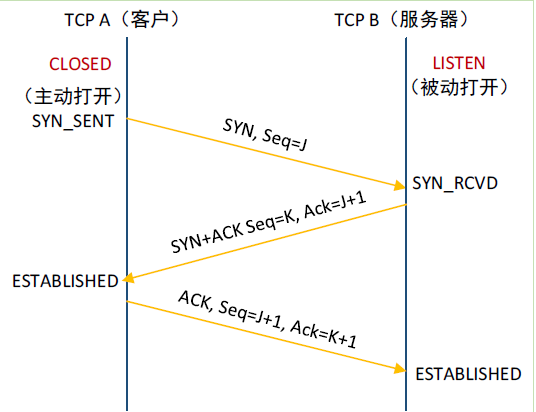

**需要注意的是**，这里会有两个端口（端口 `53736` 和端口 `53737`）分别与服务器（端口 `80`）建立连接。通过**多次抓包观察和分析**，这两个端口有时会分别传输不同的内容（比如一个端口传送音频信息，另一个端口传送其他信息），有时有一个端口什么也不做，直至关闭连接，有时可能会有三个端口与服务器建立连接。本次实验中，也发现**后续有新的端口**与服务器建立了连接。

#### 为什么是三次握手？

1. 首先，客户端向服务器发送 `SYN` ，服务器收到后，明确了建立连接的请求。
2. 然后服务器向客户端发送 `SYN + ACK` ，客户端收到后，此时的**客户端**知道自己可以**正常发送**和**正常接收**数据，也知道**服务器**可以**正常发送**和**正常接收**数据，但是此时的**服务器**并不知道自己**是否可以正常发送**以及**客户端是否可以正常接收**，只知道**客户端可以正常发送**以及**自己可以正常接收**数据。
3. 因此，需要由客户端再向服务器发送一个 `ACK` ，通知服务器，使其知道自己**可以正常发送**以及**客户端可以正常接收**数据。这样才保证了连接成功的验证。
4. 除此之外，还有一些安全方面的考虑（如 `SYN` 泛洪攻击等）。

### 传输数据

随后，客户端会不断向服务器端请求 `HTML` 页面、`CSS` 文件、音频文件、两张图片文件以及页面的图标 icon等，服务器也会返回对应的响应。

以下，是客户端请求 `HTML` 页面以及 `CSS` 文件以及服务器的对应相应的相关数据包：

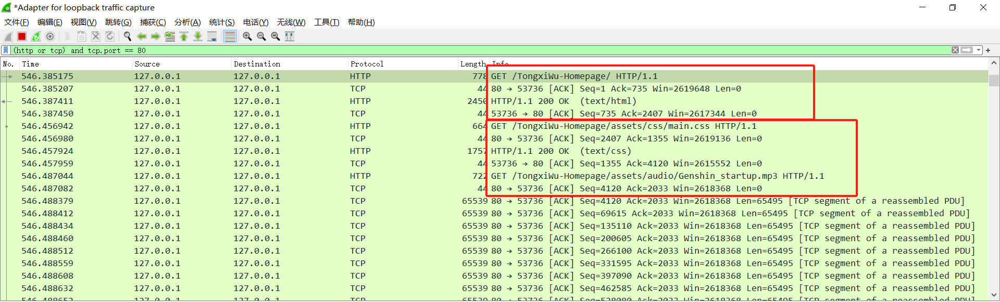

使用的一般是 get 请求，返回的响应状态码为 200 ，表示响应正常。

点击服务器返回的 **HTML** 页面的响应，可以看到对应的HTML文件内容：

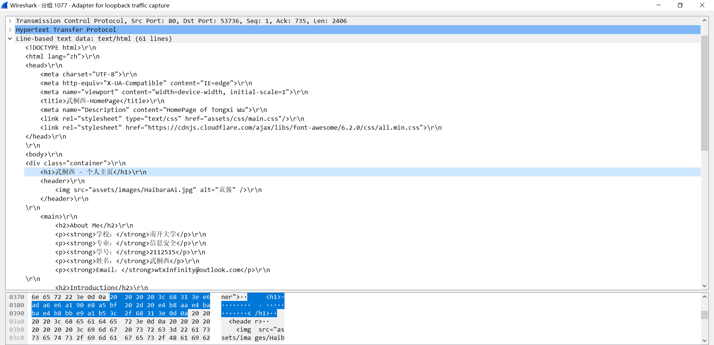

其他的请求和响应**与此类似**，因此不再赘述。

#### 流媒体文件传输

需要注意的是，这里面的音频文件属于**流媒体**文件，而且我的 Web 页面内的音频资源故意选取的比较大的文件，而流媒体文件为了保证传输的效率以及用户的流畅性体验，**对时延的要求非常高** ，因此流媒体文件一般采取的是**分段传输**。

在WireShark中，可以看到这一现象：

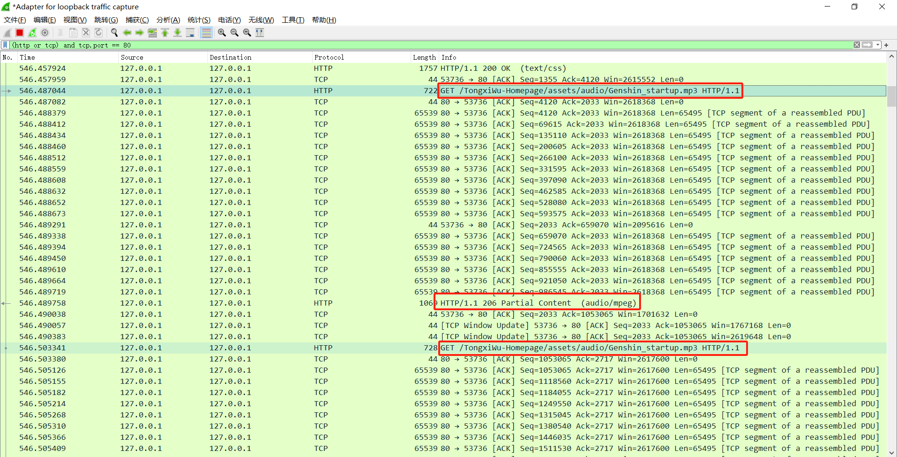

客户端向服务器发送了多个对于音频文件的请求，服务器也对客户端做出了多个响应，每一次得到的都是一个音频片段。

而中间的一串 `ACK` 是服务器或者客户端的确认。这里之所以会有服务器对客户端连续发送多个 `ACK` （每次的 `ACK` 值都相同，而 `Seq` 值为上一次发送的 `Seq` 加上发送的长度），是因为 **累计确认** 机制，这是为了节约传输的带宽以及效率考虑。

而随后的客户端发送的 `ACK` ，其 `Seq` 为服务器端发送的 `ACK` 的值，其 `ACK` 为服务器端发送的最后一个包的序列号加上长度。

#### TCP Window Update

期间，会有一些 `TCP Window Update` 的信息：

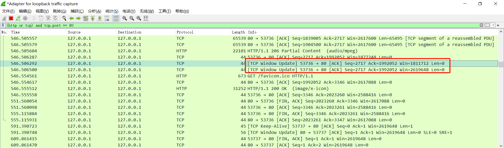

这个数据包是在客户端的接收窗口由零变为非零的可接受新消息状态的时候，由客户端向服务器发送的信息，用以通知服务器可以调整滑动窗口的大小并发送新的数据。这是为了**防止出现死锁现象**，即**服务器的滑动窗口一直为零**的状态。

#### HTTP 1.1

本次实验使用 **HTTP 1.1**。原因已在前面解释过：相比于 HTTP 1.0，**HTTP 1.1** 可以进行**持久化连接**，能够减少 TCP 的慢启动过程，同时还可以实现 **流水线机制** ，提高了效率。

#### Keep-Alive

由于使用了 **HTTP 1.1** ，这支持持久化连接。这可以通过发送 **Keep-Alive** 信息来实现。

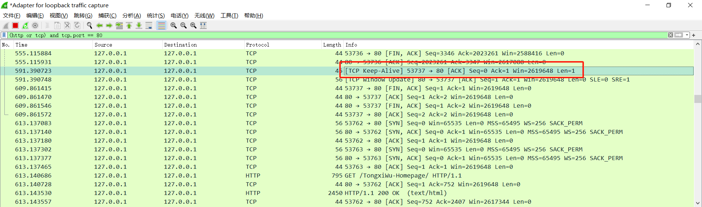

这个信息可以由客户端向服务器发送，也可以由服务器向客户端发送。如果对方回复 Keep-Alive 的 `ACK` 确认消息，则证明连接还存在，不应该断开连接。

### 四次挥手，关闭连接

最后，会进行四次挥手，关闭连接。**注意** ，这既可以由客户端发起，也可以由服务器发起，但**一般以客户端发起为更优选择**。

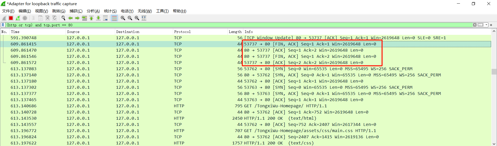

在这里，`53737` 端口主动向服务器发起断开连接的请求。四次挥手的具体过程如下（以客户端先发起为例）：

1. 客户端向服务器端发送 `FIN + ACK`，表示希望断开连接。
2. 服务器接收后，向客户端发送 `ACK`，表明收到了断连请求。实际上，此时处于 **TCP** 的**半关闭状态**。
3. 服务器处理完数据，认为可以断开连接，便向客户端发送 `FIN + ACK`。
4. 客户端收到后，向服务器发送 `ACK` 确认，并启动计时器，进入等待状态，等待 $2MSL$ （$MSL$ 即为 **Maximum Segment LifeTime** ，报文最大生成时间，是任何报文在网络上存在的最长时间，超过这个时间的报文将被丢弃）。
4. 服务器收到 `ACK` 后，便关闭连接；客户端等待 $2MSL$ 后，便关闭连接。

其过程如下图所示（对应的序列号和 `ACK` 已标出）：

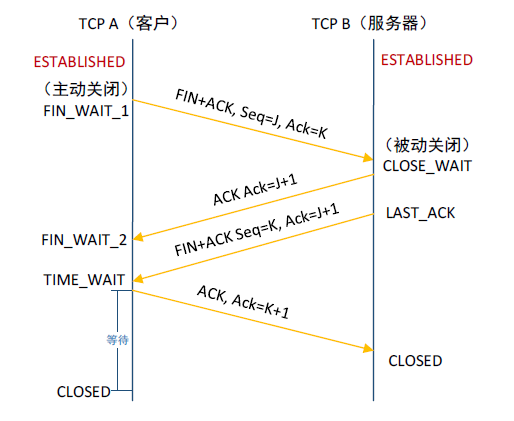

其他的四次挥手过程，包括服务器主动发起：

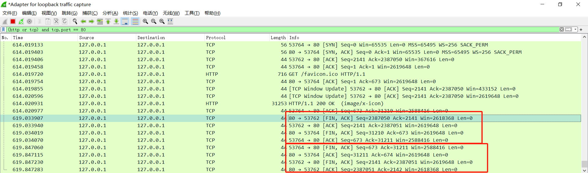

除此之外，也有可能**不是四次握手**，出现一些**其他的意外关闭**情况，比如一些 `RST` （Reset）的情况：

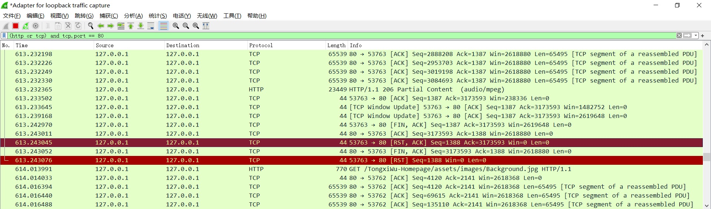

#### 为什么是四次挥手？

这是由于**TCP的半关闭**（half-close）造成的。半关闭是指：TCP提供了连接的一方在结束它的发送后还能接受来自另一端数据的能力。通俗来说，就是不能发送数据，但是还可以接受数据。

当连接处于**半关闭状态**时，TCP是允许**单向传输**数据的，也就是说服务器此时仍然可以向客户端发送数据，等服务器不再发送数据时，才会发送 `FIN` 报文段，同意现在关闭连接。

同时，中间的ACK和FIN不可以像三次握手那样合为一个报文段，是因为服务器可能还需要处理一些数据，这可能会需要很长时间，而发送 `ACK` 报文则非常快，因此中间的 `ACK` 和 `FIN` 不能合为一个包。

## 其他事项与实验感悟

1. 使用 http 协议，而不使用 https 协议，是因为 https 会对数据进行**加密**，因而WireShark捕获到的数据为密文，难以进行分析。
2. 通过本次实验，我学会了使用 WirsShark对基本的网络数据包进行抓包分析，同时了解了其过滤器规则，以便于针对性的抓包分析。
3. 通过亲自抓包分析、动手实验，我对 HTTP 协议和 TCP 协议有了更加深入的了解，对其过程以及细节也更加清晰明了，真正做到了理论与实际相结合，“读万卷书，行万里路”。

---

**作业题目：**

实验2：配置Web服务器，编写简单页面，分析交互过程

**实验要求**：

（1）搭建Web服务器（自由选择系统），并制作简单的Web页面，包含简单文本信息（至少包含专业、学号、姓名）、自己的LOGO、自我介绍的音频信息。页面不要太复杂，包含要求的基本信息即可。

（2）通过浏览器获取自己编写的Web页面，使用Wireshark捕获浏览器与Web服务器的交互过程，并进行简单的分析说明。

（3）使用HTTP，不要使用HTTPS。

（4）提交实验报告。

**评分标准（总分100分）：**

（1）功能实现：

- Web服务器搭建、编写Web页面（提交HTML文档）（30分）

- Wireshark捕获交互过程，使用Wireshark过滤器使其仅显示HTTP协议，提交捕获文件（20分）

（2）演示并讲解（30分）

（3）实验报告（20分）
