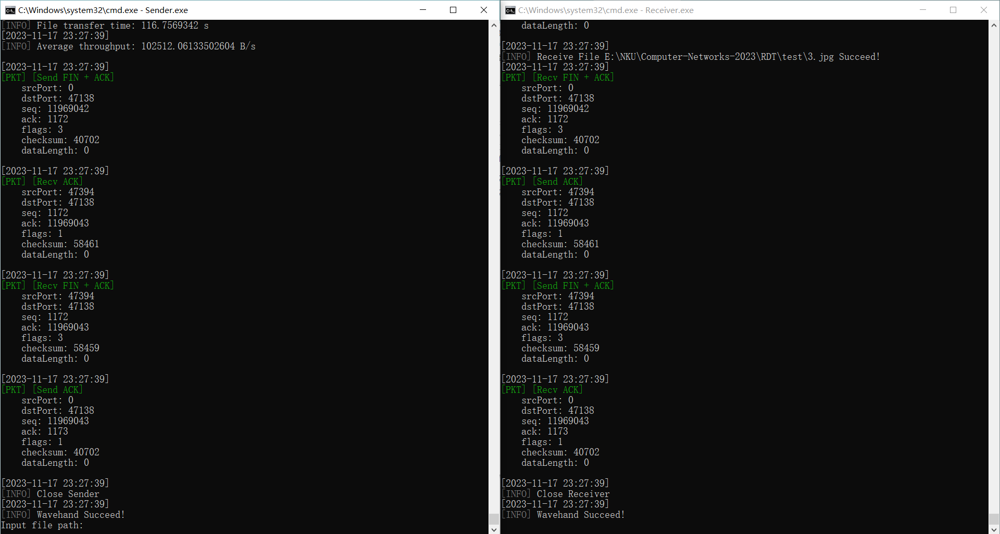
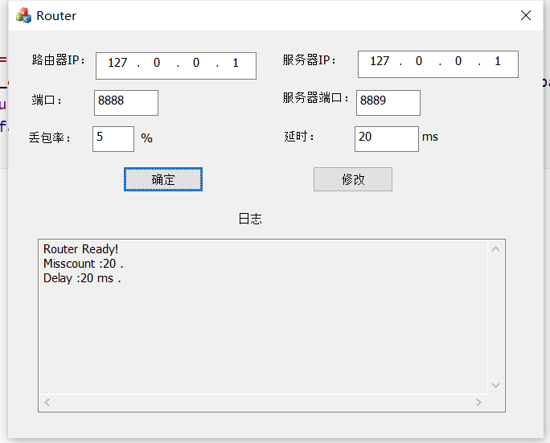

# 实验3-1：基于UDP服务设计可靠传输协议并编程实现（停等机制）

> 武桐西 2112515

## 概览

本实验参考rdt3.0，实现基于UDP服务的可靠传输协议（Reliable Data Transfer）。

## 一、协议设计

基于 UDP 的可靠传输协议（RDT），参考 rdt3.0。

利用**数据报套接字**在用户空间实现**面向连接**的可靠数据传输，采用 **停等机制** 进行流量控制，实现如下功能：

1. 建立连接：仿照TCP的**三次握手**。
2. 利用校验和（`checksum`）进行差错检验：不同于 UDP 的校验和机制，本协议不需要产生伪首部，校验和的计算域段为整个数据包（包括数据包头部和数据负载部分），以 16 bits 对齐，进行16位二进制反码求和计算。
3. 接收确认：接收端收到发送端的数据包时，通过校验后（包括校验和、相关 `flags` 、`seq` 与 `ack` 等），向发送端回复一个确认数据包（ACK包）。
4. 超时重传：当数据发生丢失时，为防止停等机制卡死在一个状态，需要在**发送方**实现超时重传机制。数据包发送时，会启动一个定时器，在预设的超时时间内，如果发送方没有收到接收方发来的对应的ACK确认包，那么超时后发送方会重新传送上次发送的数据包。
5. 关闭连接：仿照TCP的**四次挥手**。

### 数据包格式

```bash
Data Packet Format:

+-------------------------------------+
|          Source IP Address          |
+-------------------------------------+
|        Destination IP Address       |
+------------------+------------------+
|   Source Port    | Destination Port |
+------------------+------------------+
|        Sequence Number(seq)         |
+-------------------------------------+
|      Acknowledgement Number(ACK)    |
+-------------------------------------+
|    0   | BEG | END | SYN | FIN | ACK|
+------------------+------------------+
|     Checksum     |    Data Length   |
+------------------+------------------+
|                Data                 |
+-------------------------------------+
 
# 数据包头部共计 28 字节，数据负载部分按照字节对齐（不足 1 字节的补齐为 1 字节）
# 每一行包含 32 bits（4字节）
# BEG, END, SYN, FIN, ACK每个字段占 1 bit
# BEG：文件的开头；END：文件的结尾
```

其中，每个字段的含义如下表所示：

|            Field            |        Description         |
| :-------------------------: | :------------------------: |
|      Source IP Address      |         源 IP 地址         |
|   Destination IP Address    |        目的 IP 地址        |
|         Source Port         |          源端口号          |
|      Destination Port       |         目的端口号         |
|    Sequence Number(seq)     |           序列号           |
| Acknowledgement Number(ACK) |           确认号           |
|            Flags            | 0, BEG, END, SYN, FIN, ACK |
|          Checksum           |           校验和           |
|         Data Length         |         数据的长度         |
|            Data             |            数据            |

将上述数据包封装为 `struct` ：

```C++
struct DataPacket {
    unsigned int srcIP;
    unsigned int dstIP;
    unsigned short srcPort;
    unsigned short dstPort;
    unsigned int seq;
    unsigned int ack;
    unsigned int flags; // BEG: 10000, END: 01000, SYN: 00100, FIN: 00010, ACK: 00001
    unsigned short checksum;
    unsigned short dataLength;
    char data[MAX_DATA_LENGTH];
};
typedef struct DataPacket* DataPacket_t;
```

### 数据打包与数据解包

设计数据包的打包和解包函数，分别用于将数据负载封装数据头并打包为数据包、将接收到的数据解析为数据包：

```c++
DataPacket_t make_packet(
    unsigned int srcIP, unsigned int dstIP,
    unsigned short srcPort, unsigned short dstPort,
    unsigned int seq, unsigned int ack,
    unsigned int flags,
    const char* data, int dataLen
) {
    /*
     * 数据打包
     * Args:
     *      @srcIP:   Source IP Address
     *      @dstIP:   Destination IP Address
     *      @srcPort: Source Port
     *      @dstPort: Destination Port
     *      @seq:     Sequence Number
     *      @ack:     Acknowledgement Number
     *      @flags:   Flags
     *      @data:    data payload
     *      @dataLen: data payload length
     * Return:
     *     data packet
     */
    DataPacket_t packet = new DataPacket;
    packet->srcIP = srcIP;
    packet->dstIP = dstIP;
    packet->srcPort = srcPort;
    packet->dstPort = dstPort;
    packet->seq = seq;
    packet->ack = ack;
    packet->flags = flags;
    packet->checksum = 0; // 校验和清零
    packet->dataLength = dataLen; // 数据长度
    if (memcpy_s(packet->data, sizeof(packet->data), data, dataLen))
        die("Data Buffer Overflow");
    packet->checksum = ~(cal_checksum(packet)); // 校验和取反
    return packet;
}
```

```c++
bool parse_packet(char* dataPacket, int packetLen, DataPacket_t& packet) {
    /*
     * 数据解包
     * Args:
     *      @dataPacket: data packet(Header and data payload)
     *      @packetLen: data packet length (including Header)
     *      @packet: 解析出的数据包
     * Return:
     *      return true if packet is NOT corrupt
     */
    packet = (DataPacket_t)dataPacket;
    if (cal_checksum(packet) == 0xFFFF && packetLen == PKT_HEADER_SIZE + packet->dataLength)
        return true;
    return false;
}
```

### 数据包发送与接收

数据包发送的主要流程如下（伪代码，仅作示例）：

```c++
/* 发送数据包 */
// 1. 将数据封装为数据包
DataPacket_t packet = make_packet(
    senderAddr.sin_addr.s_addr, recvAddr.sin_addr.s_addr,
    senderAddr.sin_port, recvAddr.sin_port,
    seq, ack, flags,
    data, dataLen
);
// 2. 发送数据包
int ret = sendto(senderSocket, (char*)packet, PKT_HEADER_SIZE, 0, (SOCKADDR*)&recvAddr, sizeof(SOCKADDR));
if (ret == SOCKET_ERROR) {
    // 异常处理
    log(LogType::LOG_TYPE_ERROR, std::format("sendto() failed with error: {}", WSAGetLastError()));
    closesocket(senderSocket);
    WSACleanup();
    exit(1);
}
// 更新序列号seq
seq += packet->dataLength;
// 日志
log(LogType::LOG_TYPE_PKT, "[Send]", packet);
/*
 * 省略后面的发送端超时重传部分，会面会详细展示
 */
```

数据包接收的主要流程如下（伪代码，仅作示例）：

```c++
/* 接收数据包 */
// 1. recvfrom 接收数据
int addrLen = sizeof(senderAddr);
recvLen = recvfrom(recvSocket, recvBuf, sizeof(DataPacket), 0, (SOCKADDR*)&senderAddr, &addrLen);
if (recvLen == SOCKET_ERROR) {
    // 异常处理
    log(LogType::LOG_TYPE_ERROR, std::format("recvfrom() failed with error: {}", WSAGetLastError()));
    closesocket(recvSocket);
    WSACleanup();
    exit(1);
}

// 2. 数据解包
if (parse_packet(recvBuf, recvLen, recvPacket) && testFlags(recvPacket) && ack == recvPacket->seq) {
    // 测试 falgs 和 ack、seq
    log(LogType::LOG_TYPE_PKT, "[Recv]", recvPacket);
    // 更新 ack
    ack = recvPacket->seq + recvPacket->dataLength;
    return 接收成功！
} else {
    return 接收失败！
}
```

## 二、建立连接

仿照TCP的三次握手，实现连接建立。

1. 建立连接时，客户端向服务器端发送 `SYN` 。
2. 服务器端向客户端回复 `SYN + ACK` 。
3. 客户端向服务器端发送 `ACK` 。

程序三次握手日志如下图所示：


## 三、差错检验

利用校验和域段进行差错检测。不同于 UDP 的校验和机制，本协议不需要产生伪首部，校验和的计算域段为整个数据包（包括数据包头部和数据负载部分），以 16 bits 对齐，进行16位二进制反码求和计算。

1. 发送端：发送端首先将校验和域段清零，然后计算校验和，并填充到校验和域段。
2. 接收端：计算数据包的校验和，若结果为 `0xFFFF` ，则通过验证，否则不通过，即数据包出现差错。

计算校验和的算法如下：

```c++
unsigned short cal_checksum(DataPacket_t packet) {
    /*
     * 计算校验和
     * 返回值暂时不取反
     */
    unsigned int sum = 0;
    int count = (packet->dataLength + PKT_HEADER_SIZE) / 2;
    unsigned short * buf = (unsigned short *)packet;
    while (count--) {
        sum += *buf;
        if (sum & 0x10000) { // 溢出
            sum &= 0xFFFF;
            sum++;
        }
        buf++;
    }
    if ((packet->dataLength + PKT_HEADER_SIZE) & 0x1) { // 须补齐 16 位
        // (packet->dataLength + PKT_HEADER_SIZE) % 2 == 1
        packet->data[packet->dataLength] = 0;
        sum += *buf;
        // sum += (*buf) & 0xFF00;
        if (sum & 0x10000) { // 溢出
            sum &= 0xFFFF;
            sum++;
        }
    }
    // 返回值不取反
    return (sum & 0xFFFF);
}
```

## 四、接收确认

接收端收到发送端的数据包后，需要恢复一个ACK确认包，表明自己已收到数据包；发送端接收到ACK包后，才会发送下一个数据包。这就是停等机制（Stop-and-Wait）。

## 五、超时重传

当数据发生丢失时，为防止停等机制卡死在一个状态，需要在**发送方**实现超时重传机制。数据包发送时，会启动一个定时器，在预设的超时时间内，如果发送方没有收到接收方发来的对应的ACK确认包，那么超时后发送方会重新传送上次发送的数据包。

这部分的逻辑如下：

```c++
/* 上接发送端的数据包发送 */
// 超时重传
while (true) {
    // 设置 fd_set 结构
    fd_set readfds;
    FD_ZERO(&readfds); // fd_set 清空绑定
    FD_SET(senderSocket, &readfds); // fd_set 与 socket 绑定

    // 设置超时时间
    struct timeval timeout;
    timeout.tv_sec = TIME_OUT_SECS; // 单位：秒
    timeout.tv_usec = 0; // 单位：微秒

    // 使用 select 函数进行超时检测
    int ret = select(0, &readfds, NULL, NULL, &timeout);
    if (ret == 0) {
        // 超时，进行重传
        log(LogType::LOG_TYPE_INFO, "Time out! Resend packet!");
        sendto(senderSocket, (char*)packet, PKT_HEADER_SIZE + packet->dataLength, 0, (SOCKADDR*)&recvAddr, sizeof(SOCKADDR));
        log(LogType::LOG_TYPE_PKT, "[Resend]", packet);
    } else if (ret == SOCKET_ERROR) {
        // 异常处理
        log(LogType::LOG_TYPE_ERROR, std::format("select function failed with error: {}", WSAGetLastError()));
        break;
    } else {
        // 有数据可读，进行读取
        int addrLen = sizeof(recvAddr);
        recvLen = recvfrom(senderSocket, recvBuf, sizeof(DataPacket), 0, (SOCKADDR*)&recvAddr, &addrLen);
        if (parse_packet(recvBuf, recvLen, recvPacket)) { // 数据解包
            if (testFlags(recvPacket) && ack == recvPacket->seq) { // 测试 falgs 和 ack、seq
                ack = recvPacket->seq + 1; // 更新 ack
                // 日志输出
                log(LogType::LOG_TYPE_PKT, "[recv]", recvPacket);
                break; // 跳出循环，相当于取消计时器
            }
        }
    }
}
```


## 六、关闭连接

仿照TCP的四次挥手，实现关闭连接。

1. 客户端向服务器端发送 `FIN + ACK`，表示希望断开连接。
2. 服务器接收后，向客户端发送 `ACK`，表明收到了断连请求。
3. 这里简化处理，服务端直接向客户端发送 `FIN + ACK`。
4. 客户端收到后，向服务器发送 `ACK` 确认，并关闭连接（实际上也是简化了）。
4. 服务器收到 `ACK` 后，便关闭连接。

四次挥手日志如下：



## 七、实验结果

### 实验设置



### 初始界面


### 实验结果及指标


## 其他事项

- 本实验使用的C++编译器需要支持 C++20标准。
