# 实验3-2：Go-Back-N（基于滑动窗口的流量控制 + 累积确认）

> 武桐西 2112515 信息安全

## 概览

本次实验在实验3-1的基础上，将停等机制改成基于**滑动窗口**的流量控制机制，发送窗口大小大于 $1$ ，接收窗口大小为 $1$ ，支持**累积确认**，完成给定测试文件的传输。

- 参考 `rdt3.0` ，利用**数据报套接字**，在用户空间实现基于 **UDP** 的**面向连接**的**可靠数据传输** （RDT）

- 实现了 Go-Back-N **流水线协议**
- 采用基于**滑动窗口**（Sliding Window Protocol）的流量控制机制：发送端滑动窗口可以自由调节，接收端滑动窗口固定为 $1$ 
- 采用**累计确认**机制（Accumulate Acknowledgment）
- **多线程**编程，实现**并发控制**与**互斥锁**机制

## 一、实验原理

Go-Back-N 协议是一种基于**滑动窗口**的**流水线协议**，用于实现可靠的数据传输。其核心思想是在等待接收方确认之前，发送方可以连续发送多个数据包。这一点与停等机制不同，停等机制要求在发送一个数据包之后必须等待接收方的确认，然后才能发送下一个数据包。

### Go-Back-N 协议的核心思想：

1. **滑动窗口：** 发送方维护一个大小为 $N$ 的发送窗口，其中 $N$ 是窗口的最大容量。发送方可以连续发送窗口中的数据包，而不必等待接收方的确认。

2. **累积确认：** 接收方采用累积确认机制。一旦接收到正确的按序到达的数据包，接收方发送一个确认，确认的序列号是已经接收到的按序到达的最后一个数据包的序列号。这样的确认会告诉发送方，**所有序列号小于等于确认序列号的数据包都已经被成功接收**。

3. **重传机制：** 如果发送方在定时器超时前未收到确认，它会重传窗口内的所有**未确认**的数据包，从而保证数据的可靠传输。

### 与停等机制的优点比较：

1. **提高利用率：** Go-Back-N 协议通过滑动窗口实现了流水线传输，允许发送方在等待确认之前连续发送多个数据包。这提高了网络的利用率，减少了空闲时间，相对于停等机制具有更高的效率。

2. **减少等待时间：** 由于滑动窗口的存在，Go-Back-N 协议可以在等待接收方确认的同时继续发送数据，从而减少了整个传输过程中的等待时间。在高延迟的网络环境中，这一点尤为重要。

3. **减少传输时延：** 由于可以连续发送多个数据包，Go-Back-N 协议相对于停等机制可以更快地完成数据的传输，减少了整个传输的时延。

4. **更好的网络利用率：** 滑动窗口和累积确认机制的引入使得 Go-Back-N 协议更好地利用了网络带宽，提高了网络的效率。相对于停等机制，Go-Back-N 在相同网络条件下能够传输更多的数据。

总体而言，Go-Back-N 协议通过滑动窗口和累积确认的设计，相较于停等机制在可靠数据传输方面具有更高的效率和性能。**然而**，也需要注意在**高丢包率**或**高延迟**网络中，**滑动窗口过大可能导致更多的重传**，影响性能。因此，在实际应用中需要根据具体的网络条件选择合适的协议。

## 二、协议设计

Go-Back-N based RDT. 主要功能包括：

1. 建立连接
2. 校验和（`checksum`）差错检验
3. Go-Back-N **流水线协议** ，提高网络传输性能
4. 基于**滑动窗口**的流量控制机制
5. 接收端采用**累计确认**机制
6. 关闭连接
7. **并发控制**与**互斥锁**机制

### 数据报文格式

```bash
Data Packet Format:

+-------------------------------------+
|          Source IP Address          |
+-------------------------------------+
|        Destination IP Address       |
+------------------+------------------+
|   Source Port    | Destination Port |
+------------------+------------------+
|        Sequence Number(seq)         |
+-------------------------------------+
|      Acknowledgement Number(ACK)    |
+-------------------------------------+
|    0   | BEG | END | SYN | FIN | ACK|
+------------------+------------------+
|     Checksum     |    Data Length   |
+------------------+------------------+
|                Data                 |
+-------------------------------------+
 
# 数据包头部共计 28 字节，数据负载部分按照字节对齐（不足 1 字节的补齐为 1 字节）
# 每一行包含 32 bits（4字节）
# BEG, END, SYN, FIN, ACK每个字段占 1 bit
# BEG：文件的开头；END：文件的结尾
```

其中，每个字段的含义如下表所示：

|            Field            |        Description         |
| :-------------------------: | :------------------------: |
|      Source IP Address      |         源 IP 地址         |
|   Destination IP Address    |        目的 IP 地址        |
|         Source Port         |          源端口号          |
|      Destination Port       |         目的端口号         |
|    Sequence Number(seq)     |           序列号           |
| Acknowledgement Number(ACK) |           确认号           |
|            Flags            | 0, BEG, END, SYN, FIN, ACK |
|          Checksum           |           校验和           |
|         Data Length         |         数据的长度         |
|            Data             |            数据            |

将上述数据包封装为 `struct` ：

```C++
struct DataPacket {
    unsigned int srcIP;
    unsigned int dstIP;
    unsigned short srcPort;
    unsigned short dstPort;
    unsigned int seq;
    unsigned int ack;
    unsigned int flags; // BEG: 10000, END: 01000, SYN: 00100, FIN: 00010, ACK: 00001
    unsigned short checksum;
    unsigned short dataLength;
    char data[MAX_DATA_LENGTH];
};
typedef struct DataPacket* DataPacket_t;
```

> 由于滑动窗口是**固定大小**，因此无需封装在数据报文中。

### 建立连接

仿照 TCP 的三次握手，实现建立连接。

1. 建立连接时，客户端向服务器端发送 `SYN` ，随后等待接收服务器端发送的 `SYN + ACK` ，该过程中增加超时重传机制，若超时后仍未收到，则重新发送 `SYN` 报文。
2. 服务器端接收到客户端发送的 `SYN` 后，向客户端回复 `SYN + ACK` ，此时服务器端已经建立连接，可以正常工作。
3. 客户端收到服务器端发送的 `SYN + ACK` 报文后，向服务器端发送 `ACK` ，同时进入连接建立状态，可以正常工作并发送数据；需要**注意**的是，这一次握手实际上**没有必要**，完全可以省略，或者连同下一次的数据包一起发送，这里仅作示例。

本次实验中的连接建立过程基本与上次实验类似，这里不再赘述。

### 基于校验和（`checksum`）的差错检验

利用数据包中的校验和（`checksum`）域段，进行差错检验。

需要注意的是，本次实验中实现的校验和机制不完全等同于 UDP 使用的校验和机制，这里对其进行了简化处理。

1. 检验和域段是**必选**域段，与 IPv4 中 UDP 中设置 校验和域段是可选的不同。
2. 检验和计算不需要产生伪首部，而是直接对整个数据包（包括数据包头部和数据负载两部分）进行计算，这是因为 UDP 的伪首部的信息已经包含在数据报文中，因此无需再产生一个重复的伪首部。
3. 校验和计算时，以 16 bits 对齐，不足 16 bits 的需要以 $0$ 补齐，采用**16位二进制反码求和**计算。

发送端和接收端会对校验和（`checksum`）域段进行不同的处理：

1. 发送端：发送端会首先将校验和域段清零，然后计算校验和，并将其填充到数据包中的校验和域段，然后才能进行发送数据包操作。
2. 接收端：接收端收到数据包后，会对校验和域段进行检验，若校验和计算结果为全 $1$ （即 `0xFFFF`），则通过校验和验证，否则说明数据包内容出现差错，不通过校验和验证。

计算校验和的算法如下：

```c++
unsigned short cal_checksum(DataPacket_t packet) {
    /*
     * 计算校验和
     * 返回值暂时不取反
     */
    unsigned int sum = 0;
    int count = (packet->dataLength + PKT_HEADER_SIZE) / 2;
    unsigned short * buf = (unsigned short *)packet;
    while (count--) {
        sum += *buf;
        if (sum & 0x10000) { // 溢出
            sum &= 0xFFFF;
            sum++;
        }
        buf++;
    }
    if ((packet->dataLength + PKT_HEADER_SIZE) & 0x1) { // 须补齐 16 位
        // (packet->dataLength + PKT_HEADER_SIZE) % 2 == 1
        packet->data[packet->dataLength] = 0;
        sum += *buf;
        // sum += (*buf) & 0xFF00;
        if (sum & 0x10000) { // 溢出
            sum &= 0xFFFF;
            sum++;
        }
    }
    // 返回值不取反
    return (sum & 0xFFFF);
}
```

### Go-Back-N：滑动窗口 & 累计确认

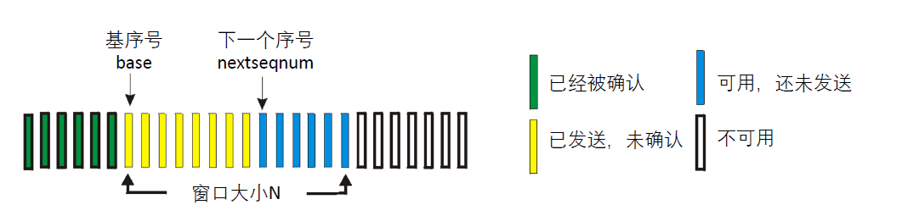

采用基于**滑动窗口**的流量控制机制。

- 发送端的滑动窗口的大小设为 $N$ ；由于采用**累计确认**机制，因此接收端的滑动窗口的大小只需为 $1$ 即可。

采用**累计确认**机制。

- 只确认连续正确接收到的数据包的最大序列号；
- 对于乱序、失序（未按序到达）的数据包，直接**丢弃不缓存**，并重发 `ACK` ，确认按序正确接收的最大的序列号。

#### 发送端行为

发送端维护一个滑动窗口，窗口起点的序列号为 `base` ，窗口大小为用户设置的固定值 $N$ （`windowSize`），同时需要维护一个发送缓冲区（实际上就是这个滑动窗口）。

注意，**发送端的序列号的范围需要使得处于同一滑动窗口内的数据包的序列号互不相同**。

窗口范围：$[base, base + windowSize)$ （不包括 $base + windowSize$ ）。

- 每次可以发送窗口内的所有数据包，无需等待接收端的确认 `ACK` 。
- 当窗口满了（窗口内所有数据包均已发送，无可用发送缓冲区）时，进入阻塞状态，阻塞数据包的发送。
- 当发送端收到了对于**处于窗口内**的数据包的确认 `ACK` 时，更新 `base` 的值为 `ACK` 包的 `ack` ，同时在窗口中移除已经确认的数据包，即**滑动窗口前移**。
- 若发送端接收的 `ACK` 数据包通过检验和验证，并且更新后的 `base` 等于当前窗口中最后一个已发送的数据包的 `seq + 1` 时（即新的滑动窗口中还没有已经发送的数据），停止计时器计时；否则重新设置并启动计时器。
- 当发送端发送的数据包的序列号恰好是 `base` 时，启动超时重传计时器。
- 当计时器超时时，重新发送发送缓冲区内（窗口内）的所有**已发送但未确认**的数据包。

以上就是发送端的行为，其对应的有限状态机如下图所示：

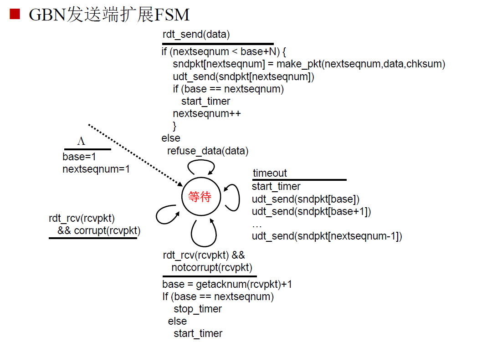

#### 接收端行为

接收端仅需维护一个大小为 $1$ 的窗口即可，原因已在前面进行说明。需维护一个希望收到的数据包序列号 `expectedseqnum` 。

- 接收端每次接收到**按序到达**的数据包时，回复对应的 `ACK` 。
- 当接收到未按序到达的数据包时，不缓存直接丢弃，同时回复希望收到的数据包序列号（即当前已确认的按序到达的数据包的最大序列号 + 1）。

接收端对应的有限状态机如下图所示：

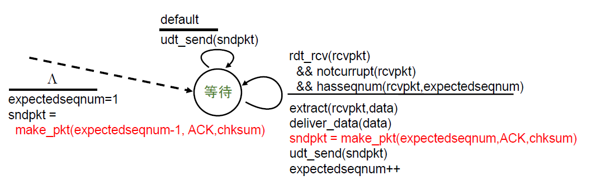

#### 重复数据包的处理

- 发送端收到重复的 `ACK` 数据包时（即该 `ACK` 没有落入当前的窗口中），则不做任何操作（直接忽略）。
- 接收端接收到数据包时，若该数据包的序列号恰好是 `expectedseqnum` （即当前已确认的按序到达的数据包的最大序列号 + 1），则发送对于该数据包的 `ACK` ；其他情况（**未按序到达**或者**数据包重复**或者**数据包校验和未通过**），则重新发送 `expectedseqnum` 对应的 `ACK` （即再次发送对于已经确认的按序到达的数据包的 `ACK`）。

#### 一些 Tricks

1. 实际上，当发送端接收到接收端发送的 `ACK` 数据包时，**无需**判断该 `ACK` 是否是已收到的 `ACK` 的连续的下一个，只需要该 `ACK` **落入当前的滑动窗口**即可进行**滑动窗口前移**。原因如下：

   当发送端接收的 `ACK` 不是已收到的 `ACK` 的连续的下一个时，说明接收端发送的前面的一些 `ACK` 在传输过程中丢失，但是既然接收端发送了对更大序列号数据包的确认 `ACK` ，而接收端采用**累计确认**，则说明接收端一定收到了前面发送的数据包。

   这样做可以再次提高传输的性能，无需做无意义的重传。

2. `in_window_interval` 函数，用于判断序列号是否落入当前窗口：

   由于序列号 `seq` 与确认号 `ack` 均为 `unsigned int` 类型，因此会出现**溢出**然后**清零** **从新开始计数** 的情况，因此这样就无法通过 `seq` 和 `base` 以及 `base + windowSize` 的绝对大小来直接确认（即若通过 $base \le seq < base + windowSize$ 来判断，可能会由于**溢出清零计数**而判断出错）。

   因此这里封装一个函数，用于判断序列号是否落入当前窗口：

   ```c++
   bool in_window_interval(unsigned int seq, unsigned int base, unsigned int windowSize) {
   	if (base + windowSize < base) {
   		// 溢出
   		return ((seq >= base) || (seq < base + windowSize));
   	}
   	else {
   		return ((seq >= base) && (seq < base + windowSize));
   	}
   }
   ```

### 关闭连接

仿照 TCP 的四次挥手，实现关闭连接。

1. 客户端向服务器端发送 `FIN + ACK`，表示希望断开连接，随后并等待接收服务器端发送的 `ACK` 和 `FIN + ACK` 。
2. 服务器接收后，向客户端发送 `ACK`，表明收到了断连请求。
3. 随后，由于在本实验中，此时服务器并无任何需要处理的数据，因此服务端直接向客户端发送 `FIN + ACK` ，这里实际上是对 TCP 四次挥手的简化处理。
4. 客户端收到服务器端发送的 `ACK` 和 `FIN + ACK` 后，向服务器发送 `ACK` 确认，并关闭连接。
5. 服务器收到 `ACK` 后，便关闭连接。

本次实验中的关闭连接过程基本与上次实验类似，这里不再赘述。

### **并发控制**与**互斥锁**机制

本次实验需要采用**多线程编程**（除了主线程之外，需要另开一个**计时器线程**，用于超时重传），因此为了防止**数据竞争**或**数据冒险**，需要进行一些控制处理。

本次实验中，实现了**并发控制**与**互斥锁**机制。

由于在主线程之外，还需要另开一个**计时器线程**用于超时重传，因此以下数据可能会导致**数据竞争**或**数据冒险**：

1. `base` ：窗口基序号，类型为 `unsigned int` 
2. `window` ：窗口（发送缓冲区），类型为 `deque<DataPacket_t>` 
3. `timerRunning` ：标志计时器是否正在运行，类型为 `bool` 
4. `timerStop` ：计时器是否停止：文件传输完成时为 `true` ，类型为 `bool` 

采用以下 C++ 头文件，进行**并发控制**与实现**互斥锁**机制：

```c++
#include <thread>  // 多线程
#include <atomic>  // 原子操作
#include <mutex>   // 互斥量
#include <condition_variable> // 条件变量，本实验中未使用
```

对于简单的数据类型（数据结构），可以直接采用 `atomic` 原子操作：

```c++
atomic<unsigned int> base; // 窗口基序号

// 计时器
atomic<bool> timerRunning; // 计时器是否正在运行
thread timerThread; // 计时器线程
atomic<bool> timerStop; // 计时器是否停止：文件传输完成时为 true
```

对于复杂的数据结构以及复杂的多线程控制操作，可以采用创建**互斥量**的方式，来保证同一时刻只能有一个线程对共享数据进行访问：

```c++
// 创建互斥量 windowMutex
deque<DataPacket_t> window; // 窗口（发送缓冲区） [base, base+windowSize)
mutex windowMutex; // 用于保护 window 的互斥锁
```

在每次访问 `window` 时，需要首先**加锁**，在使用完成后需要**释放锁**，这里采用 `std::mutex` 中提供的 `std::lock_guard` 类，它是一个 RAII（资源获取即初始化）风格的类，能够**自动**在**构造时锁定互斥量**，在**析构时解锁互斥量**。

```c++
lock_guard<mutex> lock(windowMutex); // 加锁，生命周期结束后自动解锁
/*
 * 此处省略对 window 的读写操作
 */
```

## 三、实验关键过程与源代码解释

### 计时器线程

```c++
/*
 * 建立连接时，启动计时器线程
 */
void Sender::connect() { // 建立连接
	// 初始化序列号
	seq = 0;
	ack = 0;
	this->base = 2; // base = 2，因为 0 和 1 已经被用于握手


	// 初始化计时器
	timerRunning = false;
	timerStop = false;
	/* 计时器线程启动 */
	timerThread = thread([&]() {
		while (true) {
			if (timerRunning) {
				// 设置 fd_set 结构
				fd_set readfds;
				FD_ZERO(&readfds);
				FD_SET(senderSocket, &readfds);

				// 设置超时时间
				struct timeval timeout;
				timeout.tv_sec = TIME_OUT_SECS;
				timeout.tv_usec = TIME_OUT_USECS;

				// 使用 select 函数进行超时检测
				int ret = select(0, &readfds, NULL, NULL, &timeout);
				if (ret == 0) {
					// 超时，进行重传
					log(LogType::LOG_TYPE_INFO, "Time out! Resend packet!");
					// 遍历窗口，重传所有未确认的数据包
					lock_guard<mutex> lock(windowMutex); // 加锁，生命周期结束后自动解锁
					for (auto it = window.begin(); it != window.end(); it++) {
						send_packet(senderSocket, recvAddr, *it);
					}
				}
				else if (ret == SOCKET_ERROR) {
					// Log
					log(LogType::LOG_TYPE_ERROR, std::format("select function failed with error: {}", WSAGetLastError()));
					closesocket(senderSocket);
					WSACleanup();
					exit(1);
				}
				else {
					// 有数据可读，进行读取
					char recvBuf[sizeof(DataPacket)];
					DataPacket_t recvPacket;
					int recvLen = recv_packet(senderSocket, recvAddr, recvBuf, sizeof(DataPacket), recvPacket);
					if (recvLen == -1) {
						log(LogType::LOG_TYPE_ERROR, "recv_packet() failed: checksum error");
						continue;
					}
					if (isACK(recvPacket)) {
						if (in_window_interval(recvPacket->ack, this->base + 1, windowSize)) {
							// ack = recvPacket->seq + 1;
							log(LogType::LOG_TYPE_INFO, "[ACK recv succeed]");

							// 从窗口中移除已确认的数据包
							lock_guard<mutex> lock(windowMutex); // 加锁，生命周期结束后自动解锁
							while (!window.empty() && in_window_interval(
								window.front()->seq, this->base, (recvPacket->ack - this->base)
							)) {
								delete window.front(); // 回收内存
								window.pop_front();
							}
							// 更新 base
							this->base = recvPacket->ack;

							if ((!window.empty()) && (this->base == window.back()->seq + 1)) {
								// 重置计时器
								timerRunning = false;
								if (timerStop) {
									// 文件传输完成
									break;
								}
							}
							if (window.empty()) {
								// 重置计时器
								timerRunning = false;
								if (timerStop) {
									// 文件传输完成
									break;
								}
							}
						}
					}
					else {
						log(LogType::LOG_TYPE_INFO, "[ACK recv failed]");
					}
				}
			}
		}
	});

	/*
	 * 此处省略三次握手
	 */
	
}
```

### 发送文件时的滑动窗口与累积确认

```c++
void Sender::sendFile(const char* filePath) {
	/*
	 * 此处省略前面的操作（包括对文件的操作以及发送文件名数据包（`BGE`数据包））
	 */

	char fileBuf[MAX_DATA_LENGTH]; // 文件缓冲区
	int dataLen; // 读取到的数据长度

	// 发送文件
	while (true) {
        /* 当且仅当序列号落入窗口区间（窗口不满时），才能发送数据包 */
		if (in_window_interval(seq, this->base, windowSize)) {
			// 读取文件
			fin.read(fileBuf, MAX_DATA_LENGTH);
			dataLen = fin.gcount();
			if (dataLen == 0) {
				// 文件读取完毕
				break;
			}
			// 发送数据
			packet = make_packet(
				senderAddr.sin_addr.s_addr, recvAddr.sin_addr.s_addr,
				senderAddr.sin_port, recvAddr.sin_port,
				seq, ack, 0,
				fileBuf, dataLen
			);
			sendPacket(packet);
		}
	}

	// 发送 END
	packet = make_packet(
		senderAddr.sin_addr.s_addr, recvAddr.sin_addr.s_addr,
		senderAddr.sin_port, recvAddr.sin_port,
		seq, ack, END,
		"", 0
	);
	sendPacket(packet);
	log(LogType::LOG_TYPE_INFO, "[END] File Sent!");

	// 文件传输完成
	timerStop = true;

	// 关闭文件
	fin.close();

	// 计时器线程退出
	if (timerThread.joinable()) {
		timerThread.join(); // 等待 计时器线程 退出后，才能结束主线程，在此之前主线程阻塞
	}
	
	/*
	 * 此处省略相关的日志输出
	 */
}
```

### 数据包发送

```c++
void Sender::sendPacket(DataPacket_t packet) {
	while (true) { // 阻塞直到发送成功
        /* 当且仅当序列号落入窗口区间（窗口不满时），才能发送数据包 */
		if (in_window_interval(packet->seq, this->base, windowSize)) {
			// 发送数据包
			send_packet(senderSocket, recvAddr, packet);
			seq++; // 序列号+1，而不是增加数据长度
			ack++; // 增加 ack
			// 添加到窗口
			lock_guard<mutex> lock(windowMutex); // 加锁，生命周期结束后自动解锁
			window.push_back(packet);

			if (packet->seq == this->base) {
				timerRunning = true; // set timer
			}
			break;
		}
	}
}
```

## 四、实验结果

### 实验设置

丢包率：$5 \%$ 

延迟：$10 ms$ 

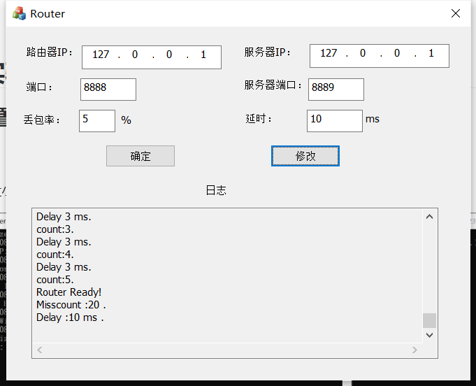

滑动窗口大小：$32$ 

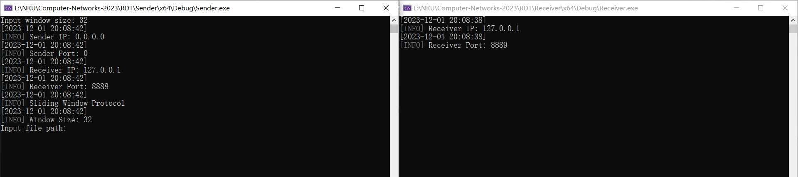

### 三次握手建立连接

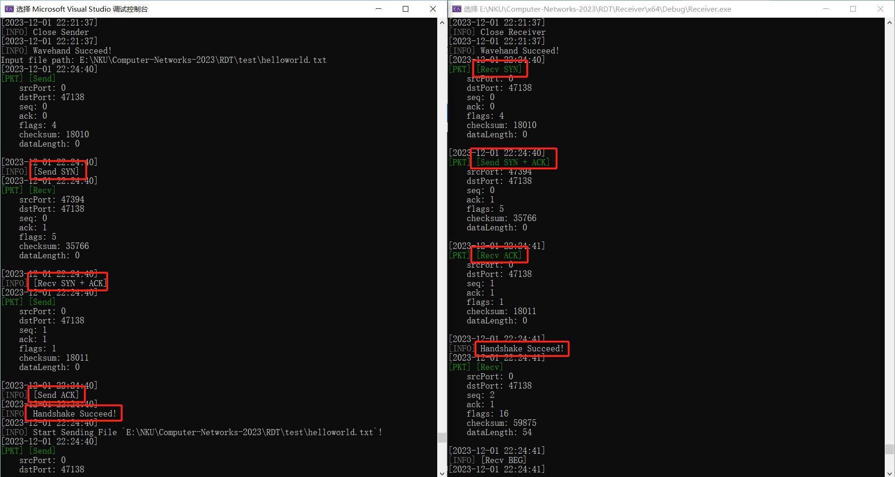

### 超时重传

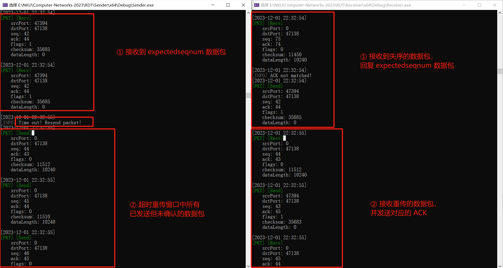

### 四次挥手关闭连接

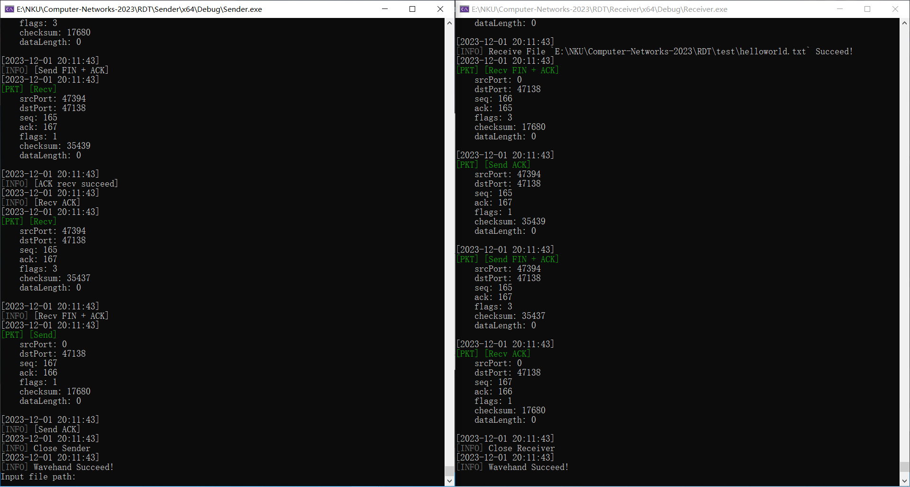

### 传输时延与吞吐率

1. `helloworld.txt`

   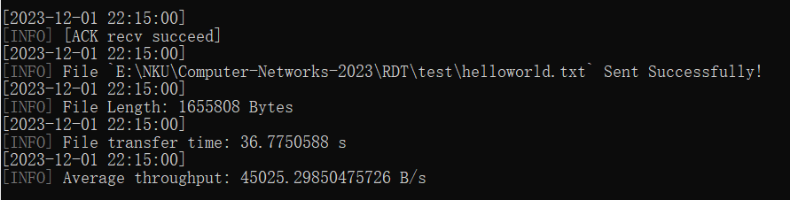

2. `1.jpg`

   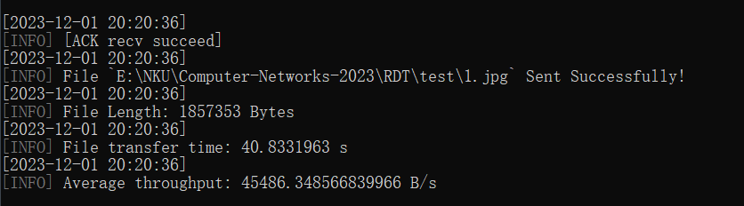

3. `2.jpg`

   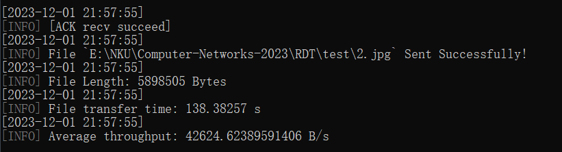

4. `3.jpg`

   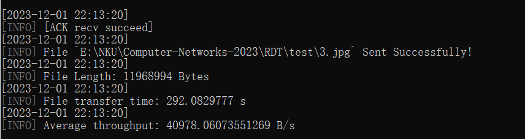

汇总如下表所示：

|                        | *helloworld.txt* |  *1.jpg*  |  *2.jpg*  |  *3.jpg*   |
| :--------------------: | :--------------: | :-------: | :-------: | :--------: |
|     文件大小 / $B$     |    $1655808$     | $1857353$ | $5898505$ | $11968994$ |
|     传输时延 / $s$     |     $36.78$      |  $40.83$  | $138.38$  |  $292.08$  |
| 平均吞吐率 / $(B / s)$ |    $45025.3$     | $45486.3$ | $42624.6$ | $40978.1$  |

## 五、实验总结与反思感悟

### 实验总结

本次实验在实验3-1的基础上，将停等机制改成基于**滑动窗口**的流量控制机制，支持**累积确认**，出色地完成了对给定测试文件的传输。

- 参考 `rdt3.0` ，利用**数据报套接字**，在用户空间实现基于 **UDP** 的**面向连接**的**可靠数据传输** （RDT）

- 实现了 Go-Back-N **流水线协议**
- 采用基于**滑动窗口**（Sliding Window Protocol）的流量控制机制：发送端滑动窗口可以自由调节，接收端滑动窗口固定为 $1$ 
- 采用**累计确认**机制（Accumulate Acknowledgment）
- **多线程**编程，实现**并发控制**与**互斥锁**机制

### 待改进之处

**日志信息的多线程并发控制：** 在发送端，由于采用了多线程，虽然对于**共享数据**，采用**并发控制**与**互斥锁**机制来消除**数据竞争**与**数据冒险**，但是却没有考虑对于**标准输出流**的多线程并发控制，因此会导致多个线程同时在命令行屏幕上打印日志，有时会导致日志的输出混乱，两个线程（计时器线程与主线程）的**日志信息交错**。

### 反思与感悟

1. 通过本次实验，我更加深入地理解了 Go-Back-N 流水线协议，亲自实现了基于滑动窗口的流量控制机制以及累积确认机制，对课内所学进行了巩固，并亲自编程实践，做到了“读万卷书，行万里路”。
2. 深入地理解了**多线程编程**，以及其中的**数据竞争**、**数据冒险**、**死锁**等多线程编程需要考虑的问题，通过**并发控制**与**互斥锁**机制可以消除上述问题；同时也对 C++ 中**多线程并发控制**的相关头文件（ `std::atomic` 、 `std::mutex` 、 `std::condition_variable` 等）有了相关的了解。

## 其他事项

1. 本实验使用的 C++ 编译器需要支持 C++20 标准。
   - 由于采用了 `std::format` ，因此所需的 C++ 编译器需要支持 C++20 标准。
   - 采用了 `std::filesystem` ，这需要编译器支持 C++17 标准。
2. 代码已在 [GitHub](https://github.com/InfinityUniverse0/Computer-Networks-2023) 开源。

