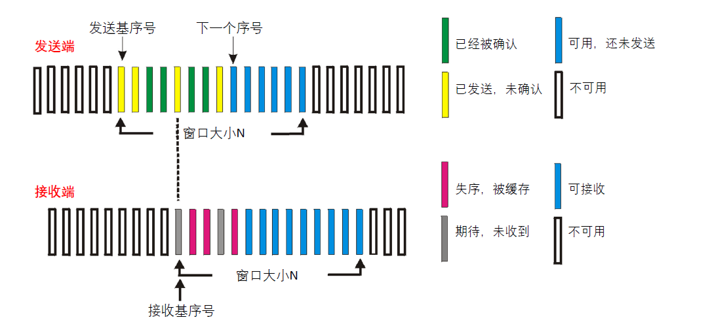
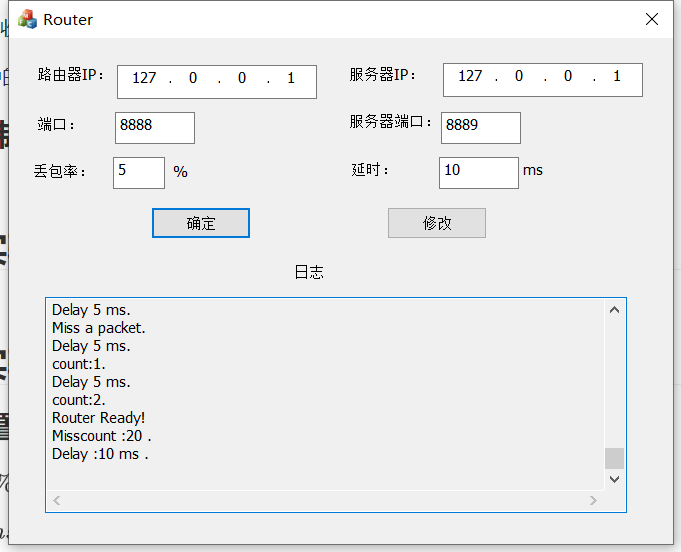
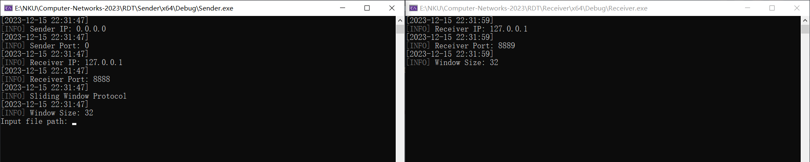
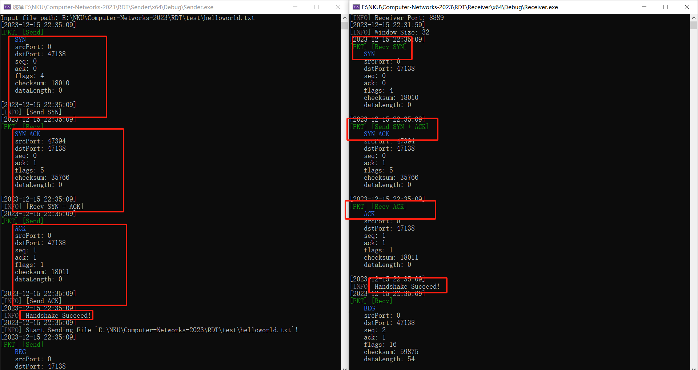
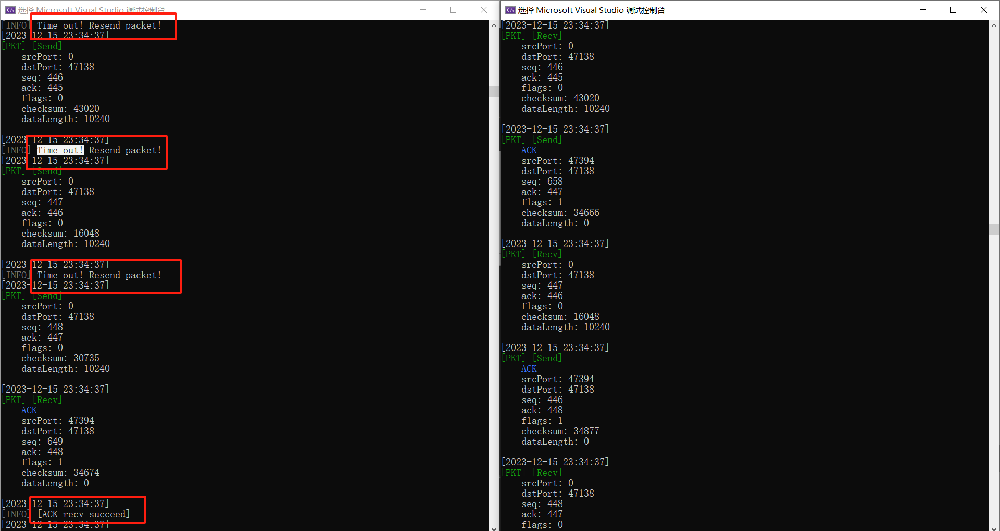
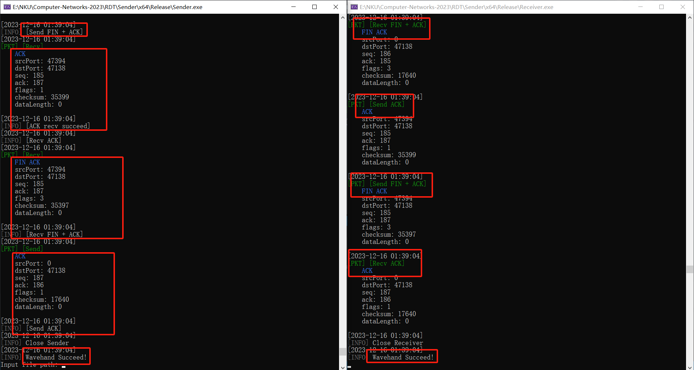
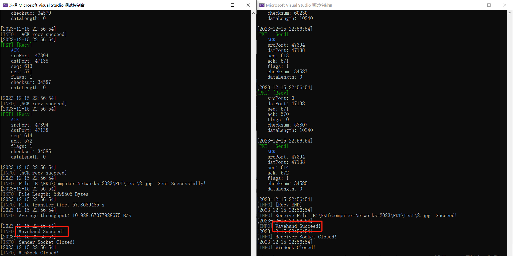
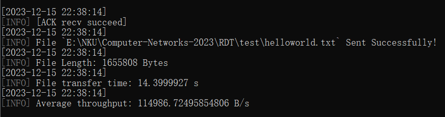
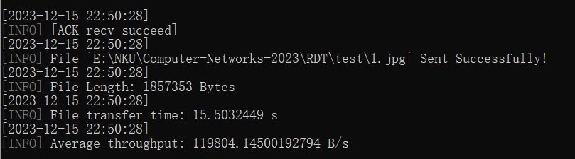
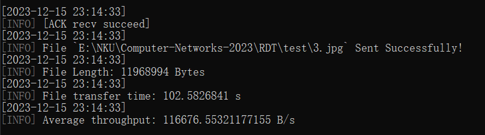

# 实验3-3：Selective Repeat（基于滑动窗口的流量控制 + 选择确认）

> 武桐西 2112515 信息安全

## 概览

本次实验在实验3-1和实验3-2的基础上，将停等机制改成基于**滑动窗口**的流量控制机制，发送窗口和接收窗口采用相同大小，支持**选择确认**，完成给定测试文件的传输。

- 参考 `rdt3.0` ，利用**数据报套接字**，在用户空间实现基于 **UDP** 的**面向连接**的**可靠数据传输** （RDT）
- 实现了 Selective Repeat **流水线协议**
- 采用基于**滑动窗口**（Sliding Window Protocol）的流量控制机制
- 采用**选择确认**机制（Selective Acknowledgment）
- **多线程** **安全** 编程，实现**并发控制**与**互斥锁**机制
- 采用**互斥锁**解决**多线程日志乱序**问题
- 优化日志显示，高亮显示数据包的 `flags` 

## 一、实验原理

**Selective Repeat（选择性重传）**是一种滑动窗口协议，用于实现可靠的数据传输。与 Go-Back-N 相比，Selective Repeat 在处理丢失的帧时更加灵活和高效。

### Selective Repeat 核心思想：

1. **窗口大小：** 发送方和接收方都有一个窗口，窗口内的帧可以被发送或接收。
2. **发送方：** 发送方可以连续发送多个帧，窗口大小通常为N。
3. **接收方：** 接收方**缓存**失序数据包，将数据包向上层应用**按序交付**。
4. **重传机制：** 发送方只需要重传未确认的数据包，而不是重传窗口内的所有数据包。

### 相较 Go-Back-N 机制的优点：

1. **灵活性：** Selective Repeat相对于Go-Back-N更加灵活。在Go-Back-N中，发生丢失时需要重传整个窗口，而Selective Repeat只需要重传具体丢失的帧，可以避免不必要的重传，提高了网络的效率。

2. **并行传输：** 在Selective Repeat中，发送方可以继续发送窗口中的其他帧，而不需要等待所有丢失的帧被重传。这允许在某些帧需要重传时，其他帧仍能继续传输，提高了并行性。

3. **带宽利用率：** 由于Selective Repeat允许并行传输，它更好地利用了网络带宽，避免了Go-Back-N中的停等现象。

4. **抵抗网络波动：** Selective Repeat更好地适应网络波动，因为它只需要重传具体丢失的帧，而不是整个窗口，减少了因网络抖动引起的不必要的重传。

总体而言，Selective Repeat相对于Go-Back-N来说在处理丢失的帧时更为高效，尤其在面对较差的网络条件或需要更大带宽利用率的情况下表现更好。

## 二、协议设计

Selective Repeat based RDT. 主要功能包括：

1. 建立连接
2. 校验和（`checksum`）差错检验
3. Selective Repeat **流水线协议** ，提高网络传输性能
4. 基于**滑动窗口**的流量控制机制
5. 采用**选择确认**机制
6. 关闭连接
7. **并发控制**与**互斥锁**机制

### 数据报文格式

```bash
Data Packet Format:

+-------------------------------------+
|          Source IP Address          |
+-------------------------------------+
|        Destination IP Address       |
+------------------+------------------+
|   Source Port    | Destination Port |
+------------------+------------------+
|        Sequence Number(seq)         |
+-------------------------------------+
|      Acknowledgement Number(ACK)    |
+-------------------------------------+
|    0   | BEG | END | SYN | FIN | ACK|
+------------------+------------------+
|     Checksum     |    Data Length   |
+------------------+------------------+
|                Data                 |
+-------------------------------------+
 
# 数据包头部共计 28 字节，数据负载部分按照字节对齐（不足 1 字节的补齐为 1 字节）
# 每一行包含 32 bits（4字节）
# BEG, END, SYN, FIN, ACK每个字段占 1 bit
# BEG：文件的开头；END：文件的结尾
```

其中，每个字段的含义如下表所示：

|            Field            |        Description         |
| :-------------------------: | :------------------------: |
|      Source IP Address      |         源 IP 地址         |
|   Destination IP Address    |        目的 IP 地址        |
|         Source Port         |          源端口号          |
|      Destination Port       |         目的端口号         |
|    Sequence Number(seq)     |           序列号           |
| Acknowledgement Number(ACK) |           确认号           |
|            Flags            | 0, BEG, END, SYN, FIN, ACK |
|          Checksum           |           校验和           |
|         Data Length         |         数据的长度         |
|            Data             |            数据            |

将上述数据包封装为 `struct` ：

```C++
struct DataPacket {
    unsigned int srcIP;
    unsigned int dstIP;
    unsigned short srcPort;
    unsigned short dstPort;
    unsigned int seq;
    unsigned int ack;
    unsigned int flags; // BEG: 10000, END: 01000, SYN: 00100, FIN: 00010, ACK: 00001
    unsigned short checksum;
    unsigned short dataLength;
    char data[MAX_DATA_LENGTH];
};
typedef struct DataPacket* DataPacket_t;
```

> 由于滑动窗口是**固定大小**，因此无需封装在数据报文中。

### 建立连接

仿照 TCP 的三次握手，实现建立连接。

1. 建立连接时，客户端向服务器端发送 `SYN` ，随后等待接收服务器端发送的 `SYN + ACK` ，该过程中增加超时重传机制，若超时后仍未收到，则重新发送 `SYN` 报文。
2. 服务器端接收到客户端发送的 `SYN` 后，向客户端回复 `SYN + ACK` ，此时服务器端已经建立连接，可以正常工作。
3. 客户端收到服务器端发送的 `SYN + ACK` 报文后，向服务器端发送 `ACK` ，同时进入连接建立状态，可以正常工作并发送数据；需要**注意**的是，这一次握手实际上**没有必要**，完全可以省略，或者连同下一次的数据包一起发送，这里仅作示例。

本次实验中的连接建立过程基本与上次实验类似，这里不再赘述。

### 基于校验和（`checksum`）的差错检验

利用数据包中的校验和（`checksum`）域段，进行差错检验。

需要注意的是，本次实验中实现的校验和机制不完全等同于 UDP 使用的校验和机制，这里对其进行了简化处理。

1. 检验和域段是**必选**域段，与 IPv4 中 UDP 中设置 校验和域段是可选的不同。
2. 检验和计算不需要产生伪首部，而是直接对整个数据包（包括数据包头部和数据负载两部分）进行计算，这是因为 UDP 的伪首部的信息已经包含在数据报文中，因此无需再产生一个重复的伪首部。
3. 校验和计算时，以 16 bits 对齐，不足 16 bits 的需要以 $0$ 补齐，采用**16位二进制反码求和**计算。

发送端和接收端会对校验和（`checksum`）域段进行不同的处理：

1. 发送端：发送端会首先将校验和域段清零，然后计算校验和，并将其填充到数据包中的校验和域段，然后才能进行发送数据包操作。
2. 接收端：接收端收到数据包后，会对校验和域段进行检验，若校验和计算结果为全 $1$ （即 `0xFFFF`），则通过校验和验证，否则说明数据包内容出现差错，不通过校验和验证。

计算校验和的算法如下：

```c++
unsigned short cal_checksum(DataPacket_t packet) {
    /*
     * 计算校验和
     * 返回值暂时不取反
     */
    unsigned int sum = 0;
    int count = (packet->dataLength + PKT_HEADER_SIZE) / 2;
    unsigned short * buf = (unsigned short *)packet;
    while (count--) {
        sum += *buf;
        if (sum & 0x10000) { // 溢出
            sum &= 0xFFFF;
            sum++;
        }
        buf++;
    }
    if ((packet->dataLength + PKT_HEADER_SIZE) & 0x1) { // 须补齐 16 位
        // (packet->dataLength + PKT_HEADER_SIZE) % 2 == 1
        packet->data[packet->dataLength] = 0;
        sum += *buf;
        // sum += (*buf) & 0xFF00;
        if (sum & 0x10000) { // 溢出
            sum &= 0xFFFF;
            sum++;
        }
    }
    // 返回值不取反
    return (sum & 0xFFFF);
}
```

### Selective Repeat：滑动窗口 & 选择确认



采用基于**滑动窗口**的流量控制机制。

- 发送端和接收端的滑动窗口大小相同，均为 $N$ （`windowSize`）。
- **序列号的范围**至少为**滑动窗口大小**的 $2$ 倍。
- 窗口范围：$[base, base + windowSize)$ （不包括 $base + windowSize$ ）

采用**选择确认**机制。

- 发送端为每一个窗口内的已发送的数据包独立计时，超时则重传**对应的**数据包。与累积确认不同，发送端**无需**重传窗口内未确认的所有数据包，**只需要**“**哪个超时重传哪个**”即可。
- 接收端独立确认每一个正确接收的数据包，若**未按序到达**，则**缓存数据包**，对于**按序到达**的数据包，**按序交付**给上层应用（在这里，上层应用即为接收传输的文件并写入本地保存）。

#### 发送端行为

发送端维护一个滑动窗口，窗口起点的序列号为 `base` ，窗口大小为用户设置的固定值 $N$ （`windowSize`），同时需要维护一个发送缓冲区（实际上就是这个滑动窗口）。

- 发送端每次可以发送窗口内的所有数据包，无需等待接收端的确认 `ACK` 。
- 当窗口满了（窗口内所有数据包均已发送，无可用发送缓冲区）时，进入阻塞状态，阻塞数据包的发送。
- 在发送每一个滑动窗口内的数据包时，为其单独启动一个定时器。定时器与发送数据包**绑定**，一旦定时器超时，并且未收到该数据包对应的 `ACK` ，则重传该数据包。
- 若收到接收端的 `ACK` ，并且该 `ACK` 是对滑动窗口内的数据包的确认，则取消对应的定时器，并将该数据包标记为已确认。
- 若收到的 `ACK` 没有落入滑动窗口内，则忽略不做处理。
- 当收到的接收端的 `ACK` 是对滑动窗口的头 `base` 的确认时，**向前移动滑动窗口**，直至遇到**第一个未确认**的数据包。

#### 接收端行为

接收端与发送端类似，同样需要维护一个滑动窗口（与发送端滑动窗口大小一致），前面已经说明，这里具体不在赘述。

- 对于落入滑动窗口内的数据包，即 $seq \in [base, base + N)$ ，发送对应数据包的 `ACK` 包。
  - 若该数据包的序号不等于基序号，即 $seq \ne base$ ，也就是说**未按序到达**，则缓存该数据包。
  - 若该数据包的序号等于基序号，即 $seq = base$ ，也就是说**按序到达**，则**向前移动滑动窗口**，同时对上层应用**按序交付**，直至遇到**第一个未按序到达**的数据包。
- 对于落入滑动窗口区间前面的数据包，即 $seq \in [base - N, base)$ ，发送对应数据包的 `ACK` 包。注意：由于滑动窗口的大小限制（发送端与接收端滑动窗口**大小相同**，**序列号的范围**至少为**滑动窗口大小**的 $2$ 倍），因此如果数据包**不出现差错**，那么落入滑动窗口区间前面的数据包的序列号一定不会小于 $base - N$ 。
- 对于**其他序列号**的数据包，做**丢弃**处理。

#### 重复数据包的处理

- 发送端接收到重复的 `ACK` 数据包时，不做任何操作（直接忽略并丢弃即可）。
- 接收端接收到重复的数据包时，若对应数据包的 $seq \in [base - N, base + N)$ ，则重新发送对应数据包的 `ACK` 即可；如果数据包**不出差错**，那么数据包的序列号 $seq$ 不可能是其他的取值。

#### 一些 Tricks

1. `in_window_interval` 函数，用于判断序列号是否落入当前窗口：

   由于序列号 `seq` 与确认号 `ack` 均为 `unsigned int` 类型，因此会出现**溢出**然后**清零** **从新开始计数** 的情况，因此这样就无法通过 `seq` 和 `base` 以及 `base + windowSize` 的绝对大小来直接确认（即若通过 $base \le seq < base + windowSize$ 来判断，可能会由于**溢出清零计数**而判断出错）。

   因此这里封装一个函数，用于判断序列号是否落入当前窗口：

   ```c++
   bool in_window_interval(unsigned int seq, unsigned int base, unsigned int windowSize) {
   	if (base + windowSize < base) {
   		// 溢出
   		return ((seq >= base) || (seq < base + windowSize));
   	}
   	else {
   		return ((seq >= base) && (seq < base + windowSize));
   	}
   }
   ```

2. `get_window_index` 辅助函数，用于获取序列号在滑动窗口中的相对索引值：

   该函数用于获取序列号在滑动窗口中的相对索引值，辅助后面的一些操作。

   同样是由于序列号 `seq` 与基序号 `base` 均为 `unsigned int` 类型，因此会出现**溢出**然后**清零** **从新开始计数** 的情况，所以封装该函数。

   但是实际上，通过推导可知，无论是否溢出均可以通过直接相减得到正确结果，因此实际上可以不用封装。

   在这里将其设置为内联函数 `inline` ，封装函数如下：

   ```c++
   // 获取数据包对应的 window 索引
   inline unsigned int get_window_index(unsigned int seq, unsigned int base) {
   	// 无论是否溢出
   	return (seq - base);
   }
   ```

### 关闭连接

仿照 TCP 的四次挥手，实现关闭连接。

1. 客户端向服务器端发送 `FIN + ACK`，表示希望断开连接，随后并等待接收服务器端发送的 `ACK` 和 `FIN + ACK` 。
2. 服务器接收后，向客户端发送 `ACK`，表明收到了断连请求。
3. 随后，由于在本实验中，此时服务器并无任何需要处理的数据，因此服务端直接向客户端发送 `FIN + ACK` ，这里实际上是对 TCP 四次挥手的简化处理。
4. 客户端收到服务器端发送的 `ACK` 和 `FIN + ACK` 后，向服务器发送 `ACK` 确认，并关闭连接。
5. 服务器收到 `ACK` 后，便关闭连接。

本次实验中的关闭连接过程基本与上次实验类似，这里不再赘述。

### **并发控制**与**互斥锁**机制

本次实验需要采用**多线程编程**，因此为了防止**数据竞争**或**数据冒险**，需要进行一些控制处理。

本次实验中，实现了**并发控制**与**互斥锁**机制。

本次 SR 实验，发送端需要采用多线程，除了主线程外，需要另外开启的线程有：

1. 接收数据包线程 `recvThread`
2. 每一个**已发送但未确认**的数据包的**计时器超时重传线程** `timerThread` （为节约资源，收到 `ACK` 后即结束对应线程）

并发控制与互斥锁机制的实现方式**与上次实验相同**，这里不做过多的赘述。只简单陈述如下：

采用以下 C++ 头文件，进行**并发控制**与实现**互斥锁**机制：

```c++
#include <thread>  // 多线程
#include <atomic>  // 原子操作
#include <mutex>   // 互斥量
#include <condition_variable> // 条件变量，本实验中未使用
```

对于简单的数据类型（数据结构），可以直接采用 `atomic` 原子操作：

```c++
atomic<unsigned int> base; // 窗口基序号

// 接收数据包线程
thread recvThread;
atomic<bool> recvRunning; // 接收数据包线程是否运行
```

对于复杂的数据结构以及复杂的多线程控制操作，可以采用创建**互斥量**的方式，来保证同一时刻只能有一个线程对共享数据进行访问：

```c++
// 创建互斥量 windowMutex
deque<DataPacket_t> window; // 窗口（发送缓冲区） [base, base+windowSize)
deque<bool> ackWindow; // 对应窗口位置是否收到 ACK
mutex windowMutex; // 用于保护 window 和 ackWindow 的互斥锁

// 计时器
deque<thread*> timerThreads; // 计时器线程双端队列
```

在每次访问 `window` （同时也会访问 `ackWindow` ，二者同步访问）时，需要首先**加锁**，在使用完成后需要**释放锁**，这里采用 `std::mutex` 中提供的 `std::lock_guard` 类，它是一个 RAII（资源获取即初始化）风格的类，能够**自动**在**构造时锁定互斥量**，在**析构时解锁互斥量**。

```c++
lock_guard<mutex> lock(windowMutex); // 加锁，生命周期结束后自动解锁
/*
 * 此处省略对 window 和 ackWindow 的读写操作
 */
```

同时，在上一次实验中的 **待改进之处** 中，笔者提到了**多线程日志乱序问题**，在本次实验中，通过**互斥锁**解决该问题：

```c++
std::mutex logMutex; // Log Mutex

// Log
void log(LogType type, const std::string& msg, DataPacket_t packet, bool showTime) {
    /* 为标准输出流 cout 加锁 */
    std::lock_guard<std::mutex> lock(logMutex); // 加锁，生命周期结束后自动解锁
    /*
     * 此处省略日志函数的具体操作
     */
}
```

### 其他

1. 日志输出采用彩色命令行，显示更醒目；
2. 日志输出数据包时，高亮显示数据包对应的 `flags` ，增加易读性。

## 三、实验关键过程与源代码解释

### 发送端接收线程

```c++
void Sender::recvThreadFunc() {
	while (true) {
		if ((recvRunning == false) && window.empty())
			break; // 结束线程
		char recvBuf[sizeof(DataPacket)];
		DataPacket_t recvPacket;
		
		int recvLen = recv_packet(senderSocket, recvAddr, recvBuf, sizeof(DataPacket), recvPacket);
		if (recvLen == -1) {
			log(LogType::LOG_TYPE_ERROR, "recv_packet() failed: checksum error");
			continue;
		}

		// 用于计时器线程防止死锁
		unsigned int count = 0;
		if (isACK(recvPacket)) {
			lock_guard<mutex> lock(windowMutex); // 加锁，生命周期结束后自动解锁
			if (in_window_interval(recvPacket->ack, this->base + 1, windowSize)) {
				log(LogType::LOG_TYPE_INFO, "[ACK recv succeed]");

				// 是否是窗口的开头
				if (recvPacket->ack == this->base + 1) { // 是，则前移滑动窗口
					ackWindow.front() = true;
					while (!window.empty() && (ackWindow.front() == true)) {
						delete window.front(); // 回收内存
						window.pop_front();
						ackWindow.pop_front();
						// 更新 base
						(this->base)++;
						// 增加 count 计数
						count++;
					}
				}
				else {
					// 修改对应的 ackWindow
					ackWindow.at(get_window_index(recvPacket->ack, this->base + 1)) = true;
				}
			}
		}
		else {
			log(LogType::LOG_TYPE_INFO, "[ACK recv failed]");
		}
		// 互斥锁已释放，从而避免死锁
		for (unsigned int i = 0; i < count; i++) {
			std::thread* timer = this->timerThreads.front();
			if (timer->joinable()) {
				timer->join(); // 等待释放
			}
			delete timer; // 回收内存
			this->timerThreads.pop_front();
		}
	}
}
```

### 计时器线程

```c++
void Sender::timerThreadFunc(unsigned int packet_seq) {
	while (true) {
		// sleep
		std::this_thread::sleep_for(std::chrono::seconds(TIME_OUT_SECS));
		std::this_thread::sleep_for(std::chrono::microseconds(TIME_OUT_USECS));

		// check if received ACK
		bool hasACKed = true;
		{
			lock_guard<mutex> lock(windowMutex); // 加锁，生命周期结束后自动解锁
			auto ack_it = ackWindow.begin();
			for (auto it = window.begin(); it != window.end(); it++) {
				if ((*it)->seq == packet_seq) { // found
					if (*ack_it == false) { // ack NOT received
						hasACKed = false;
						// 超时重传
						log(LogType::LOG_TYPE_INFO, "Time out! Resend packet!");
						// 重发数据包
						send_packet(senderSocket, recvAddr, (*it));
					}
					break;
				}
				ack_it++;
			}
		}
		if (hasACKed)
			break; // 结束线程
	}
}
```

### 发送数据包

```c++
void Sender::sendPacket(DataPacket_t packet) {
	while (true) { // 阻塞直到发送成功
		if (in_window_interval(packet->seq, this->base, windowSize)) {
			// 发送数据包
			send_packet(senderSocket, recvAddr, packet);
			seq++; // 序列号+1，而不是增加数据长度
			ack++; // 增加 ack
			{
				// 添加到窗口
				lock_guard<mutex> lock(windowMutex); // 加锁，生命周期结束后自动解锁
				window.push_back(packet);
				ackWindow.push_back(false);
			}

			/* 计时器线程启动 */
			std::thread* timer = new std::thread(std::bind(&Sender::timerThreadFunc, this, packet->seq));
			this->timerThreads.push_back(timer);

			break;
		}
	}
}
```

### 接收端接收数据包

```c++
bool Receiver::recvPacket() {
	/*
	 * 接收数据包
	 * Return:
	 * 		当可以写入文件时，return true
	 */
	DataPacket_t packet = new DataPacket;
	char* buf = (char*)packet;
	int recvLen = recv_packet(recvSocket, senderAddr, buf, sizeof(DataPacket), packet);
	if (recvLen == -1) {
		log(LogType::LOG_TYPE_ERROR, "recv_packet() failed: checksum error");
		return false;
	}

	// 判断是否位于窗口区间
	if (in_window_interval(packet->seq, this->base, windowSize)) {
		// 发送 ACK
		DataPacket_t ackPacket = make_packet(
			recvAddr.sin_addr.s_addr, senderAddr.sin_addr.s_addr,
			recvAddr.sin_port, senderAddr.sin_port,
			seq, (packet->seq + 1), ACK,
			"", 0
		);
		this->sendACK(ackPacket);
		delete ackPacket; // 回收内存

		// 更新 ack
		if (in_window_interval(packet->seq + 1, this->ack, windowSize)) {
			this->ack = packet->seq + 1;
		}

		if (packet->seq == this->base) {
			if (window.empty()) {
				window.push_back(packet);
			}
			else {
				DataPacket_t winPkt = window.front();
				if (winPkt == nullptr) {
					window.front() = packet;
				}
			}
			// 可以写入文件
			return true;
		}
		else { // 写入窗口
			if (window.empty()) { // window 为空
				window.push_back(nullptr);
			}
			unsigned int index = get_window_index(packet->seq, this->base);
			while (window.size() < index) {
				window.push_back(nullptr);
			}
			if (window.size() == index) {
				window.push_back(packet);
			}
			else {
				DataPacket_t winPkt = window.at(index);
				if (winPkt == nullptr) { // 之前未收到
					window.at(index) = packet; // 将 nullptr 改为 packet
				}
			}
		}
	}
	else { // 位于 [base-windowSize, base) 区间
		// 发送 ACK
		DataPacket_t ackPacket = make_packet(
			recvAddr.sin_addr.s_addr, senderAddr.sin_addr.s_addr,
			recvAddr.sin_port, senderAddr.sin_port,
			packet->ack, (packet->seq + 1), ACK,
			"", 0
		);
		this->sendACK(ackPacket);
		seq--;
		delete ackPacket; // 回收内存
	}

	return false;
}
```

### 接收端写入文件

```c++
// 接收数据
bool recvEND = false;
while (true) {
    if (recvEND) {
        fout.close(); // 关闭文件
        log(LogType::LOG_TYPE_INFO, std::format("Receive File `{}` Succeed!", filePath));
        assert(window.empty());
        break;
    }
    if (this->recvPacket()) { // 准备写入文件
        unsigned int count = 0;
        auto it = window.begin();
        while (!window.empty() && (it != window.end()) && (*it != nullptr)) {
            if (isEND(*it)) {
                log(LogType::LOG_TYPE_INFO, "[Recv END]");
                recvEND = true;
                delete window.front(); // 回收内存
                window.pop_front();
                // 更新 base
                (this->base)++;
                break;
            }
            else {
                // 写入文件
                fout.write((*it)->data, (*it)->dataLength);
                if (!fout) {
                    log(LogType::LOG_TYPE_ERROR, "Failed to write to file");
                    // Need to close socket?
                    closesocket(recvSocket);
                    WSACleanup();
                    exit(1);
                }
            }

            // 前移滑动窗口
            it++;
            count++;
            // 更新 base
            (this->base)++;
        }

        for (unsigned int i = 0; i < count; i++) {
            delete window.front(); // 回收内存
            window.pop_front();
        }
    }
}
```

## 四、实验结果

### 实验设置

丢包率：$5 \%$ 

延迟：$10 ms$ 



滑动窗口大小：$32$ 



### 三次握手建立连接



### 超时重传



### 四次挥手关闭连接



<!--  -->

### 传输时延与吞吐率

1. `helloworld.txt`

   

2. `1.jpg`

   

3. `2.jpg`

   

4. `3.jpg`

   

汇总如下表所示：

|                        | *helloworld.txt* |  *1.jpg*   |  *2.jpg*   |  *3.jpg*   |
| :--------------------: | :--------------: | :--------: | :--------: | :--------: |
|     文件大小 / $B$     |    $1655808$     | $1857353$  | $5898505$  | $11968994$ |
|     传输时延 / $s$     |     $14.40$      |  $15.50$   |  $57.87$   |  $102.58$  |
| 平均吞吐率 / $(B / s)$ |    $114986.7$    | $119804.1$ | $101928.7$ | $116676.6$ |

## 五、实验总结与反思感悟

### 实验总结

本次实验在实验3-1和实验3-2的基础上，将停等机制改成基于**滑动窗口**的流量控制机制，发送窗口和接收窗口采用相同大小，支持**选择确认**，出色地完成了给定测试文件的传输。

- 参考 `rdt3.0` ，利用**数据报套接字**，在用户空间实现基于 **UDP** 的**面向连接**的**可靠数据传输** （RDT）
- 实现了 Selective Repeat **流水线协议**
- 采用基于**滑动窗口**（Sliding Window Protocol）的流量控制机制
- 采用**选择确认**机制（Selective Acknowledgment）
- **多线程** **安全** 编程，实现**并发控制**与**互斥锁**机制
- 采用**互斥锁**解决**多线程日志乱序**问题
- 优化日志显示，高亮显示数据包的 `flags` 

### 反思与感悟

1. 通过本次实验，我更加深入地理解了 Selective Repeat 流水线协议，亲自实现了基于滑动窗口的流量控制机制以及选择确认机制，对课内所学进行了巩固，并亲自编程实践，做到了“读万卷书，行万里路”。
2. 深入地理解了**多线程编程**，以及其中的**数据竞争**、**数据冒险**、**死锁**等多线程编程需要考虑的问题，通过**并发控制**与**互斥锁**机制可以消除上述问题；同时也对 C++ 中**多线程并发控制**的相关头文件（ `std::atomic` 、 `std::mutex` 、 `std::condition_variable` 等）有了相关的了解。

## 其他事项

1. 本实验使用的 C++ 编译器需要支持 C++20 标准。
   - 由于采用了 `std::format` ，因此所需的 C++ 编译器需要支持 C++20 标准。
   - 采用了 `std::filesystem` ，这需要编译器支持 C++17 标准。
2. 代码已在 [GitHub](https://github.com/InfinityUniverse0/Computer-Networks-2023) 开源。