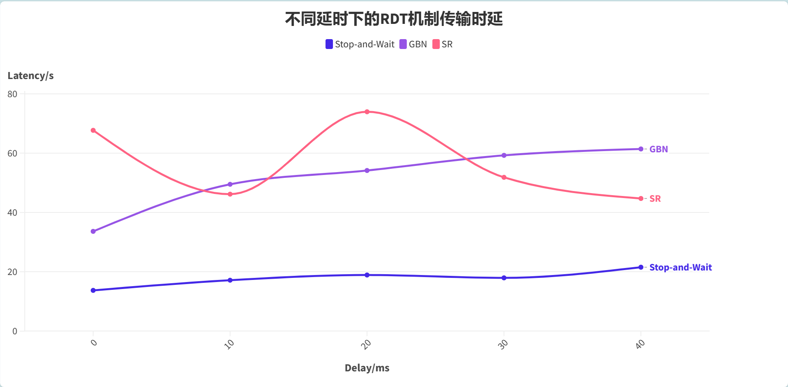
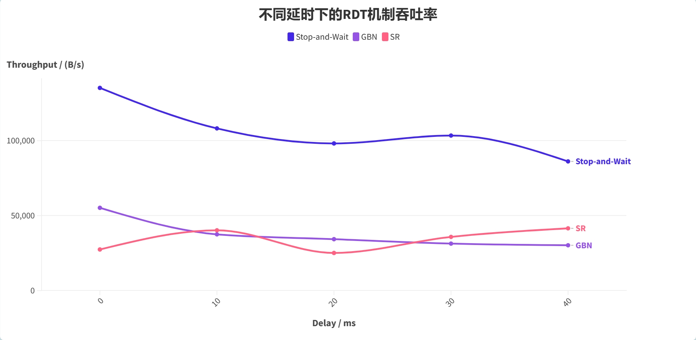
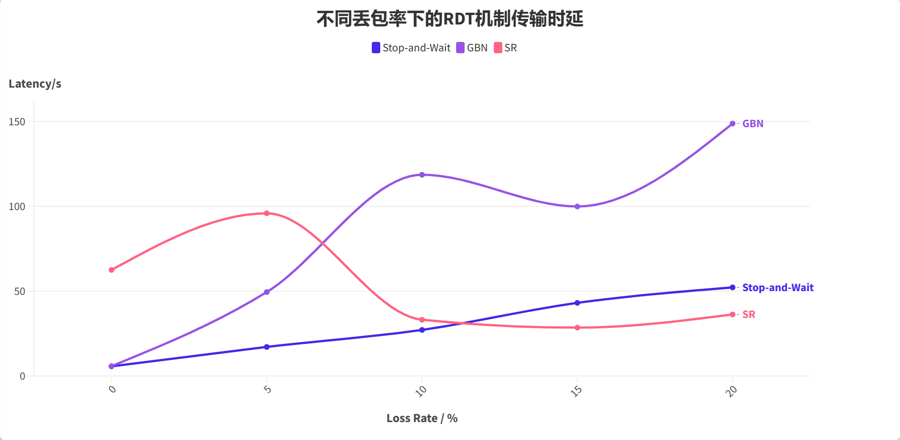
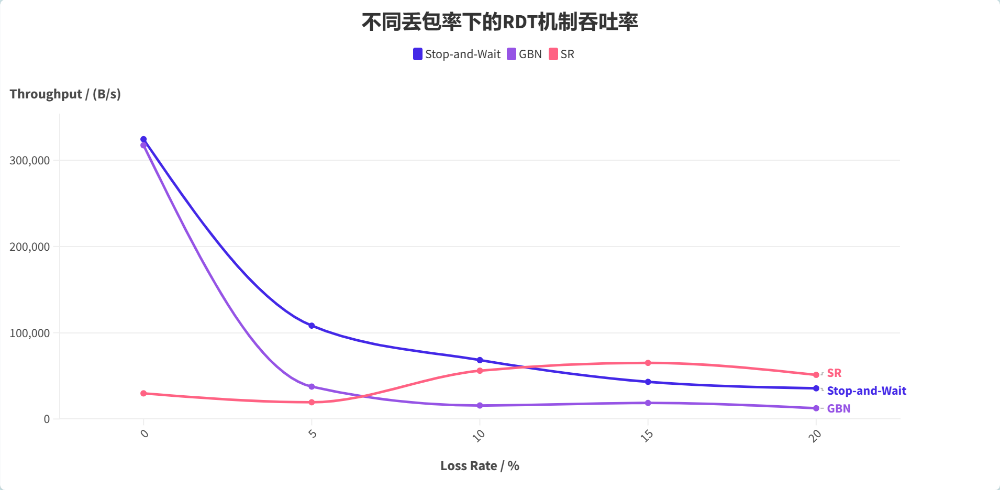
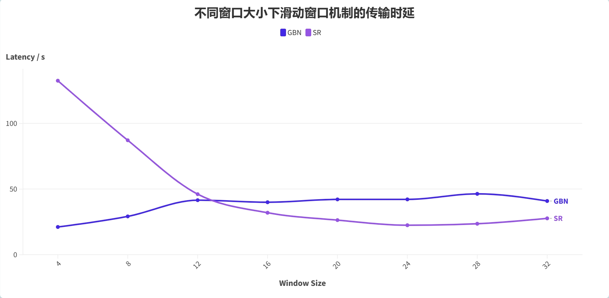
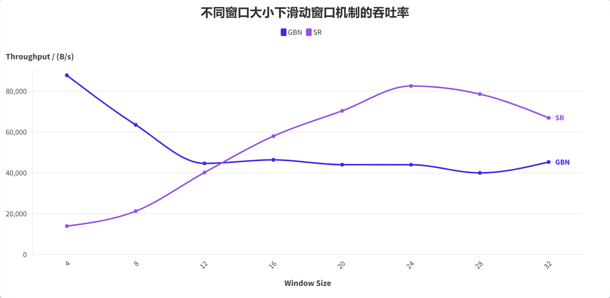
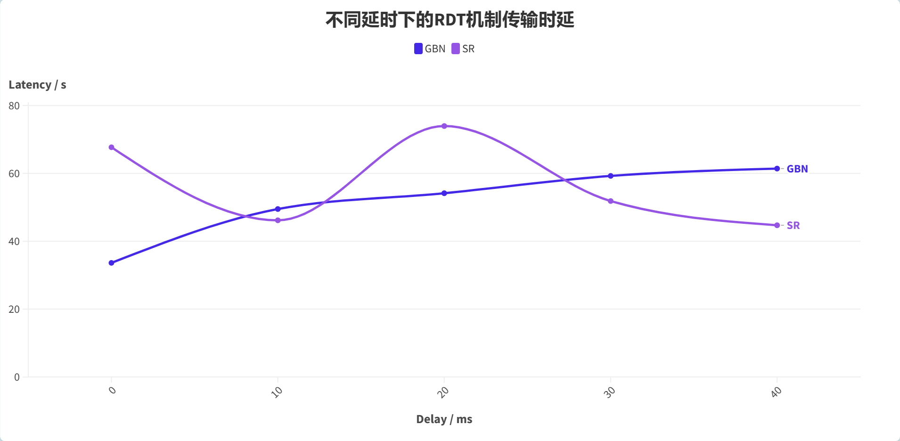
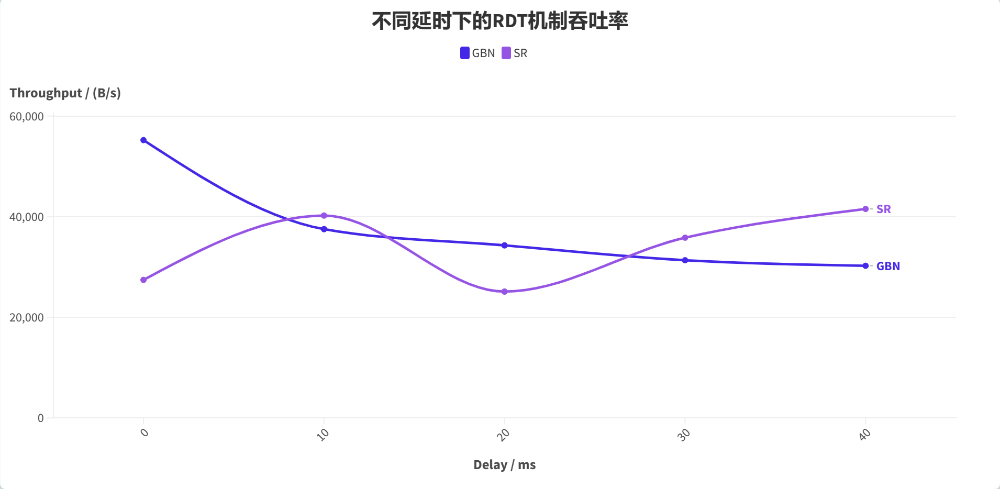
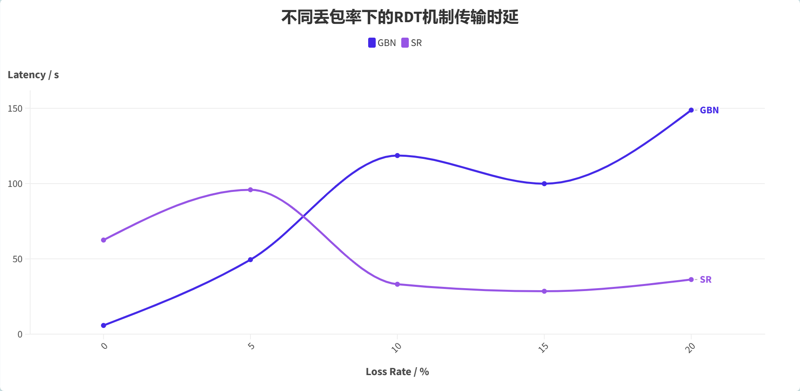
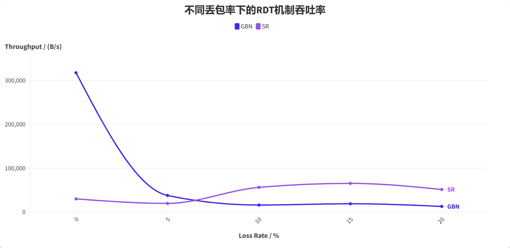

# 实验3-4：RDT性能对比分析

> 武桐西 2112515 信息安全

## 概览

本次实验基于给定的实验测试环境，通过改变**延时**和**丢包率**，完成下面3组性能对比实验：

1. **停等机制**与**滑动窗口**机制性能对比；
2. 滑动窗口机制中**不同窗口大小**对性能的影响（**累计确认**和**选择确认**两种情形）；
3. 滑动窗口机制中**相同窗口大小**情况下，**累计确认**和**选择确认**的性能比较。

## 实验设置

- **传输文件**：`1.jpg`
- **性能测试指标**：传输时延（Latency）与吞吐量（Throughput）
- **超时重传时间**（RTO）： $1s$ 
- **单个数据包数据Payload大小上限**：$10240 Bytes$
- **实验变量**：
  1. 延时（Delay）
  2. 丢包率（Packet Loss Rate）
  3. 滑动窗口大小（Window Size）
- **网络环境模拟**：采用给定的路由器Router，进行网络环境的模拟（延迟和丢包率）

## 一、停等机制与滑动窗口机制性能对比

设定滑动窗口的大小固定为 $12$ 。

### 延时对三种RDT机制的性能影响

固定丢包率为 $5\%$ ，固定滑动窗口的大小为 $12$ ，探究不同的延时（Delay）对三种RDT机制的性能的影响。

#### 传输时延（Latency）

| Delay / $m s$ | Loss Rate / $\%$ | Stop-and-Wait / $s$ | GBN / $s$ | SR / $s$ |
| :-----------: | :--------------: | :-----------------: | :-------: | :------: |
|      $0$      |       $5$        |        13.74        |   33.63   |  67.68   |
|     $10$      |       $5$        |        17.17        |   49.49   |  46.17   |
|     $20$      |       $5$        |        18.92        |   54.14   |  73.93   |
|     $30$      |       $5$        |        17.96        |   59.24   |  51.84   |
|     $40$      |       $5$        |        21.55        |   61.40   |  44.71   |

#### 吞吐率（Throughput）

| Delay / $m s$ | Loss Rate / $\%$ | Stop-and-Wait / $(B/s)$ | GBN / $(B/s)$ | SR / $(B/s)$ |
| :-----------: | :--------------: | :---------------------: | :-----------: | :----------: |
|      $0$      |       $5$        |         135216          |     55229     |    27443     |
|     $10$      |       $5$        |         108199          |     37530     |    40229     |
|     $20$      |       $5$        |          98164          |     34306     |    25122     |
|     $30$      |       $5$        |         103431          |     31351     |    35829     |
|     $40$      |       $5$        |          86179          |     30249     |    41543     |

#### 结果分析

##### 理论分析

从理论上讲，在相同的丢包率下，随着延迟（Delay）的增加，三种RDT机制的性能均有所下降。

在同一延迟（Delay）下，

- 若**不存在丢包**现象，（若GBN的接收端没有实现“接收若干个包仅发送一个ACK”的这种类似机制）则三种RDT机制的性能相差应该不大；如果考虑到滑动窗口机制的多线程消耗（包括并发控制与互斥锁机制）以及滑动窗口的开销，停等机制甚至由于两种滑动窗口机制。

- 若**存在丢包**现象，一般而言，三者**性能**：SR $>$ Stop-and-Wait $>$ GBN。

  这是因为：

  1. SR会对窗口内的每一个包单独设置定时器，超时时只会重发对应的包，并且由于其一次性会发送窗口内的所有数据包，同时，接收端对于失序到达的数据包，只要其位于滑动窗口内，则进行缓存而不必丢失，因此其性能优于 Stop-and-Wait 和 GBN；
  2. GBN机制由于采用累积确认机制，在窗口内出现丢包时，会重传窗口内的所有的数据包；对于接收端而言，虽然收到了后续的数据包，但是由于其无法缓存数据包，因此只能将其丢弃；这样一来，每一次丢包都会造成许多无所谓的数据包重传，不仅增加了网络占用，同时性能也会下降，因此其性能比停等机制更差。

##### 实际结果分析

其他结果基本与理论分析相同，唯一不同的是SR机制并不是最优的，甚至性能最差，并且存在**较大的波动**。

笔者猜测可能的原因与自己的实现方式有关：

1. SR采用**多线程**安全编程，笔者为窗口内的每一个数据包都单独开一个线程，用于设定计时器并超时重传，**线程的数量与滑动窗口的大小相关**。由于线程较多，处理器的性能有限，并且联系到**操作系统的线程处理机制**（对于单核处理器，同一时刻实际上只有一个线程正在运行，不同的线程是分片执行的），因此较多的线程以及操作系统的调度会使得SR的性能下降，没能达到理论上应有的高性能。

   同时，这也解释了为什么SR的性能会产生较大的波动。

2. 另一方面，为了多线程访问共享数据的安全，SR的实现增加了并发控制与互斥锁机制，并且由于线程的数量众多，多个线程均会争夺同一把锁，因此可能会导致线程的**排队现象**，这进一步影响了SR的性能。

### 丢包率对三种RDT机制的性能影响

固定延时（Delay）为 $10ms$ ，固定滑动窗口的大小为 $12$ ，探究不同丢包率对三种RDT机制性能的影响。

#### 传输时延（Latency）

| Delay / $m s$ | Loss Rate / $\%$ | Stop-and-Wait / $s$ | GBN / $s$ | SR / $s$ |
| :-----------: | :--------------: | :-----------------: | :-------: | :------: |
|     $10$      |       $0$        |        5.72         |   5.85    |  62.52   |
|     $10$      |       $5$        |        17.17        |   49.49   |  95.89   |
|     $10$      |       $10$       |        27.19        |  118.60   |  33.19   |
|     $10$      |       $15$       |        43.13        |   99.91   |  28.55   |
|     $10$      |       $20$       |        52.24        |  148.76   |  36.31   |

#### 吞吐率（Throughput）

| Delay / $m s$ | Loss Rate / $\%$ | Stop-and-Wait / $(B/s)$ | GBN / $(B/s)$ | SR / $(B/s)$ |
| :-----------: | :--------------: | :---------------------: | :-----------: | :----------: |
|     $10$      |       $0$        |         324434          |    317418     |    29708     |
|     $10$      |       $5$        |         108199          |     37530     |    19369     |
|     $10$      |       $10$       |          68317          |     15661     |    55966     |
|     $10$      |       $15$       |          43059          |     18589     |    65055     |
|     $10$      |       $20$       |          35555          |     12486     |    51155     |

#### 结果分析

总体而言，随着丢包率的增加，三种RDT的性能均有所下降。

忽略相关的异常点（SR的波动、GBN的异常点），总体而言，随着丢包率的增加，三者的性能下降趋势为：GBN $>$ Stop-and-Wait $>$ SR。原因如下：

- 由于GBN在出现丢包时，接收端对于失序的数据包**不缓存直接丢弃**，同时发送端只启动一个定时器，因此当超时时，需要重传窗口内的所有数据包，因此这使得其收丢包率的影响最大。
- 对于 Stop-and-Wait 停等机制而言，由于其每次只发送一个数据包，只有等到收到接收端的ACK时，才会发送下一个数据包，也就是说，其超时重传时，只会重传一个数据包，同时考虑到其等待当前数据包的ACK的等待时间（“停等”），因此其瘦到丢包率的影响适中。
- 对于SR，由于其为窗口内每个数据包单独设置计时器，超时重传时，只需发送对应的超时的数据包即可，不需要发送窗口内已确认收到的数据包；对于接收端，只要数据包在滑动窗口范围内，即使失序到达，接收端也能缓存数据包；同时，由于采用滑动窗口，因此可以一次性发送窗口内的多个数据包，综上而言，其受到丢包率的影响最小。

关于SR性能曲线出现明显波动的原因，可以参见前面的解释（**线程过多** + **互斥锁的等待与争夺**）。

## 二、滑动窗口机制中不同窗口大小对性能的影响（累计确认和选择确认）

固定延迟（Delay）为 $10ms$ ，固定丢包率（Loss Rate）为 $5 \%$ ，探究不同窗口大小对于滑动窗口机制的性能影响。

### 传输时延（Latency）

| Window Size | Delay / $m s$ | Loss Rate / $\%$ | GBN / $s$ | SR / $s$ |
| :---------: | :-----------: | :--------------: | :-------: | :------: |
|      4      |      10       |        5         |   21.16   |  132.60  |
|      8      |      10       |        5         |   29.23   |  87.23   |
|     12      |      10       |        5         |   41.58   |  46.17   |
|     16      |      10       |        5         |   40.01   |  32.02   |
|     20      |      10       |        5         |   42.17   |  26.39   |
|     24      |      10       |        5         |   42.19   |  22.50   |
|     28      |      10       |        5         |   46.40   |  23.63   |
|     32      |      10       |        5         |   40.95   |  27.74   |

### 吞吐率（Throughput）

| Window Size | Delay / $m s$ | Loss Rate / $\%$ | GBN / $(B/s)$ | SR / $(B/s)$ |
| :---------: | :-----------: | :--------------: | :-----------: | :----------: |
|      4      |      10       |        5         |     87769     |    14008     |
|      8      |      10       |        5         |     63534     |    21291     |
|     12      |      10       |        5         |     44665     |    40229     |
|     16      |      10       |        5         |     46419     |    58002     |
|     20      |      10       |        5         |     44046     |    70381     |
|     24      |      10       |        5         |     44022     |    82555     |
|     28      |      10       |        5         |     40026     |    78593     |
|     32      |      10       |        5         |     45352     |    66957     |

### 结果分析

随着滑动窗口的增大，SR的性能从比GBN差，逐渐过渡到比GBN的性能更优，**最终**二者均**趋于一个相对稳定状态**。

根据图中结果来看，前两个测试点很可能是异常点，可能是由于SR的实现原因（**线程过多** + **互斥锁的等待和竞争**）导致的。

1. 基于**累计确认**的滑动窗口机制：随着窗口大小的增加，传输时延会随之减少，吞吐率会随之上升。这是因为存在丢包现象时，当窗口大小变大时，每次传送的数据包数量增多，总的传输次数减少，总的传输时延会减少，吞吐率会上升。
2. 基于**选择确认**的滑动窗口机制：随着窗口大小的增加，传输时延会随之减少，吞吐率会随之上升。这是因为存在丢包现象时，当窗口大小变大时，接收端可缓存的失序分组更多，使得总的传输次数减少，从而总的传输时延减少，吞吐率上升。并且由于选择确认对每个数据包单独进行确认的机制，会使得其能更有效地利用更大的窗口，性能也会比累计确认更优。

## 三、滑动窗口机制中相同窗口大小情况下，累计确认和选择确认的性能比较

固定滑动窗口的大小为 $12$ ，改变延迟（Delay）和丢包率（Loss Rate），对累计确认机制和选择确认机制的性能进行对比分析。

### 延时对不同滑动窗口机制的性能影响

固定丢包率为 $5\%$ ，固定滑动窗口的大小为 $12$ ，探究不同延时对滑动窗口机制性能的影响。

#### 传输时延（Latency）

| Delay / $m s$ | Loss Rate / $\%$ | GBN / $s$ | SR / $s$ |
| :-----------: | :--------------: | :-------: | :------: |
|      $0$      |       $5$        |   33.63   |  67.68   |
|     $10$      |       $5$        |   49.49   |  46.17   |
|     $20$      |       $5$        |   54.14   |  73.93   |
|     $30$      |       $5$        |   59.24   |  51.84   |
|     $40$      |       $5$        |   61.40   |  44.71   |

#### 吞吐率（Throughput）

| Delay / $m s$ | Loss Rate / $\%$ | GBN / $(B/s)$ | SR / $(B/s)$ |
| :-----------: | :--------------: | :-----------: | :----------: |
|      $0$      |       $5$        |     55229     |    27443     |
|     $10$      |       $5$        |     37530     |    40229     |
|     $20$      |       $5$        |     34306     |    25122     |
|     $30$      |       $5$        |     31351     |    35829     |
|     $40$      |       $5$        |     30249     |    41543     |

#### 结果分析

在相同的丢包率下，随着延迟（Delay）的增加，两种滑动窗口机制的性能均有所下降。

在同一延迟（Delay）下，

- 若**不存在丢包**现象，（若GBN的接收端没有实现“接收若干个包仅发送一个ACK”的这种类似机制）则两种滑动窗口机制的性能相差应该不大。

- 若**存在丢包**现象，一般而言，二者**性能**：SR $>$ GBN。

  这是因为：

  1. SR会对窗口内的每一个包单独设置定时器，超时时只会重发对应的包，并且由于其一次性会发送窗口内的所有数据包，同时，接收端对于失序到达的数据包，只要其位于滑动窗口内，则进行缓存而不必丢失，因此其性能优于GBN；
  2. GBN机制由于采用累积确认机制，在窗口内出现丢包时，会重传窗口内的所有的数据包；对于接收端而言，虽然收到了后续的数据包，但是由于其无法缓存数据包，因此只能将其丢弃；这样一来，每一次丢包都会造成许多无所谓的数据包重传，不仅增加了网络占用，同时性能也会下降，因此其性能比SR更差。

实际测试时，由于前面讲到的原因（**线程过多** + **互斥锁的等待和竞争**），从而导致SR的性能没有达到理想状态，并且出现了较大的波动。

### 丢包率对不同滑动窗口机制的性能影响

固定延时为 $10ms$ ，固定滑动窗口的大小为 $12$ ，探究不同丢包率对滑动窗口机制性能的影响。

#### 传输时延（Latency）

| Delay / $m s$ | Loss Rate / $\%$ | GBN / $s$ | SR / $s$ |
| :-----------: | :--------------: | :-------: | :------: |
|     $10$      |       $0$        |   5.85    |  62.52   |
|     $10$      |       $5$        |   49.49   |  95.89   |
|     $10$      |       $10$       |  118.60   |  33.19   |
|     $10$      |       $15$       |   99.91   |  28.55   |
|     $10$      |       $20$       |  148.76   |  36.31   |

#### 吞吐率（Throughput）

| Delay / $m s$ | Loss Rate / $\%$ | GBN / $(B/s)$ | SR / $(B/s)$ |
| :-----------: | :--------------: | :-----------: | :----------: |
|     $10$      |       $0$        |    317418     |    29708     |
|     $10$      |       $5$        |     37530     |    19369     |
|     $10$      |       $10$       |     15661     |    55966     |
|     $10$      |       $15$       |     18589     |    65055     |
|     $10$      |       $20$       |     12486     |    51155     |

#### 结果分析

总体而言，随着丢包率的增加，两种滑动窗口机制的性能均有所下降，SR的性能优于GBN。

忽略相关的异常点（SR的波动、GBN的异常点），总体而言，随着丢包率的增加，二者的性能下降趋势为：GBN $>$ SR。原因如下：

- 由于GBN在出现丢包时，接收端对于失序的数据包**不缓存直接丢弃**，同时发送端只启动一个定时器，因此当超时时，需要重传窗口内的所有数据包，因此这使得其收丢包率的影响较大。
- 对于SR，由于其为窗口内每个数据包单独设置计时器，超时重传时，只需发送对应的超时的数据包即可，不需要发送窗口内已确认收到的数据包；对于接收端，只要数据包在滑动窗口范围内，即使失序到达，接收端也能缓存数据包；同时，由于采用滑动窗口，因此可以一次性发送窗口内的多个数据包，综上而言，其受到丢包率的影响较小。

实际测试时，由于前面讲到的原因（**线程过多** + **互斥锁的等待和竞争**），从而导致在前两个测试点，SR的性能没有达到理想状态，并且出现了较大的波动。

## 四、实验总结

本次实验在前面实验的基础上，探究了不同网络环境下（延迟和丢包率）三种RDT机制的性能。

总体结论如下：

1. 若**不存在丢包**现象，（若GBN的接收端没有实现“接收若干个包仅发送一个ACK”的这种类似机制）则三种RDT机制的性能相差应该不大；如果考虑到滑动窗口机制的多线程消耗（包括并发控制与互斥锁机制）以及滑动窗口的开销，停等机制甚至由于两种滑动窗口机制。
2. 若**存在丢包**现象，一般而言，三者**性能**：SR $>$ Stop-and-Wait $>$ GBN。

---

除此之外，由于SR机制的实现机制，会导致其存在 **线程过多** + **互斥锁的等待和竞争** 的现象，使得其性能没有达到理想要求，并且可能会出现较大的抖动（异常点等）。
